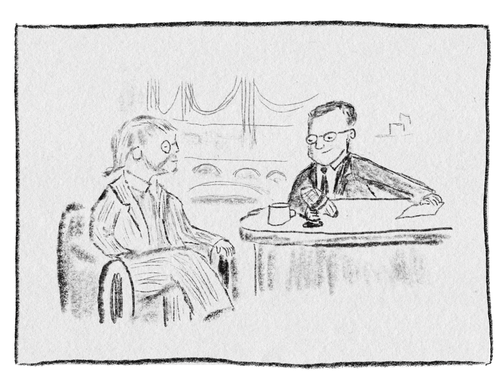
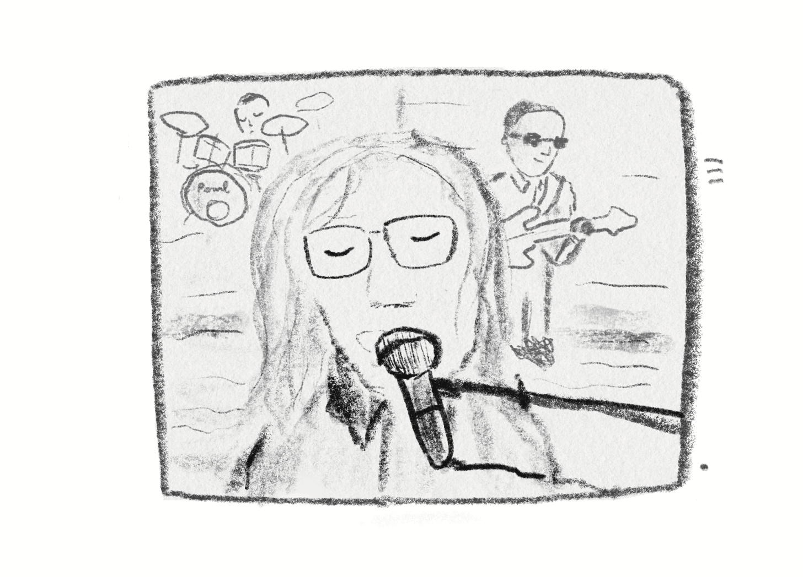
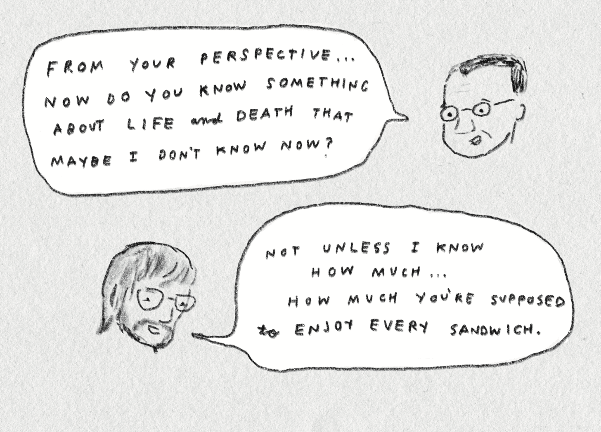
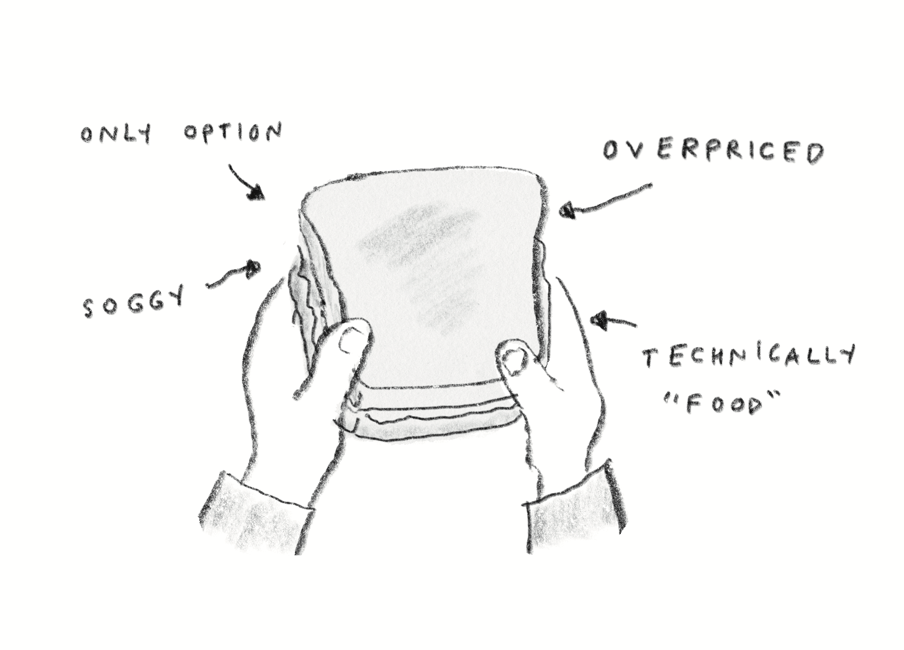
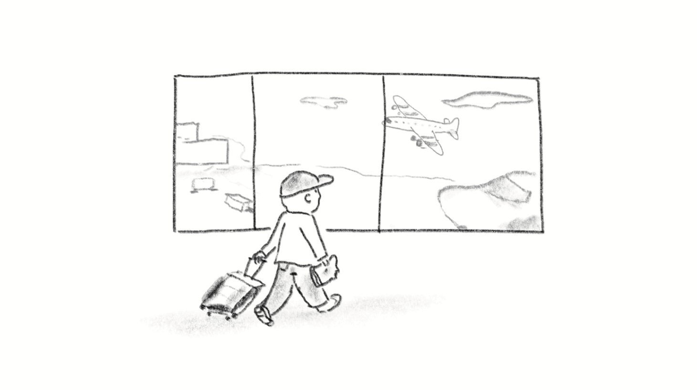
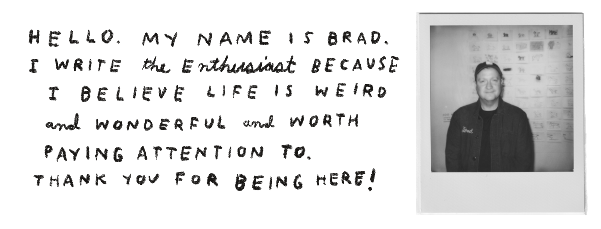

> **来源与授权｜Source and permission**
>
> **作者｜Author：** Brad Montague
>
> **原文标题｜Original title：** _Enjoy Every Sandwich_
>
> **原文发表于｜Originally published：** September 22, 2026
>
> **原文链接｜Original article：** [Enjoy Every Sandwich](https://bradmontague.substack.com/p/enjoy-every-sandwich)
>
> 本文经授权制作并发布中英双语版。英文正文按原文顺序保留，中文译文紧随相应段落；原文插画与链接一并保留。｜This bilingual edition is reproduced and translated with permission. The English text follows the original order, with the Chinese translation immediately after each corresponding passage. The original illustrations and links are retained.

Warren Zevon appeared on _The Late Show with David Letterman_ in October of 2002.

> 2002 年 10 月，Warren Zevon 登上了 David Letterman 主持的《深夜秀》。

I drew my remembrance of the appearance below. (_Apologies to Dave, who has been rendered here in a way that kind of makes him look like Richard Nixon. This was not intentional, but here we are. I’m still learning._)

> 我把记忆中的那次亮相画了下来。向 Dave 道个歉——画里的他不知怎么有点像 Richard Nixon。这并非有意，但画出来就是这样。我还在学习。

Zevon had appeared on Letterman’s show many times through the years …

> 多年来，Zevon 曾多次登上 Letterman 的节目……

… but this time was different. Zevon knew he was going to die.

> ……但这一次不同。Zevon 知道自己将不久于人世。

He was walking through the final days of a diagnosis with terminal cancer.

> 他正走过被诊断为癌症晚期后，生命最后的那段日子。

What could’ve been deeply unsettling instead became something deeply compelling. Something that has remained with me for years. The two talked about music and family, but also _life_ and _death_. It was all somehow beautiful and human and … also _funny_ and incredibly _moving._ All at once.

> 这本可能令人极度不安的一幕，却变得深深打动人心，并在此后多年一直留在我的记忆里。两人谈论音乐与家庭，也谈到**生命**与**死亡**。这一切既美好又有人情味，同时还**有趣**得出奇，也令人无比**动容**。所有感受同时发生。

**This part of their exchange has stuck with me probably every day since:**

> **从那以后，他们的这段对话大概每天都会浮现在我脑海里：**

**Dave:** _From your perpsective now, do you know something about life and death that maybe I don’t know now?_  
**Warren:** _Not unless I know how much … how much you’re supposed to **enjoy every sandwich**._

> **Dave：** 以你现在的视角，你是否明白了一些关于生与死、而我现在还不明白的事？  
> **Warren：** 除非我知道……你究竟应该多么……**享受每一个三明治**。

---

**Warren:**  
_You put more value on every minute. You do. I mean I always thought I kind of did that. I really always enjoyed myself, but it’s more valuable now. You’re reminded to enjoy every sandwich and every minute of playing with the guys and being with the kids and everything._

> **Warren：**  
> 你会更加珍视每一分钟。真的会。我是说，我一直以为自己多少已经在这样做了。我一直都很享受生活，但现在，每一分钟都更珍贵了。你会被提醒，要享受每一个三明治，享受和乐队伙伴一起演奏的每一分钟，享受陪伴孩子们的每一分钟，享受这一切。

I’d just finished re-reading (this time listening) to Jason Zinoman’s book on Letterman. My Youtube algorithm has been, wonderfully, feeding me classic Letterman clips. Last week, this clip snuck up on me from a different angle (and this time with an actual sandwich in my hand).

> 我刚刚重读完 Jason Zinoman 那本关于 Letterman 的书——这次是用听的。令人开心的是，YouTube 的算法一直在给我推荐 Letterman 的经典片段。上周，这段视频从另一个角度猝不及防地击中了我——而这一次，我手里真的拿着一个三明治。

During a quick layover on my way home from a speaking engagement, I was sitting in a terminal. Traveling from Canada to Nashville. _Happy_ to have had the work. _Grateful_ for the experience. _Anxious_ about upcoming work. _Tired._ _Worried_ about all sorts of things. _Laughing_ at a picture Kristi sent me from the kids. _Hungry_.

> 一场演讲结束后，我在回家途中短暂停留，坐在航站楼里，准备从加拿大飞往 Nashville。**开心**能得到这份工作，**感激**这段经历，又为接下来的工作感到**焦虑**。**疲惫**，为各种事情**担忧**，看着 Kristi 发来的孩子们的照片又忍不住**发笑**。还很**饿**。

I bought a sandwich.

> 我买了一个三明治。

It was not a great sandwich.

> 它并不好吃。

Soggy and overpriced and maybe “food” (not sure) … it was what was available.

> 湿软、昂贵，也许算是“食物”吧——不太确定……但当时只有这个。

I thought of Warren’s words. It hit me that maybe he didn’t necessarily mean every sandwich is going to actually be great. Some sandwiches are bad. They just are. Some days will be a challenge, too. There will be disappointments. Hurts. Things that simply aren’t at all what we hoped they would be.

> 我想起 Warren 的话。忽然意识到，他未必是在说每一个三明治都会真的很美味。有些三明治就是很糟。事实如此。有些日子同样会充满挑战，会有失望，会受伤，会遇到一些完全不如我们所愿的事情。

I don’t think the answer is to pretend everything is wonderful.

> 我不认为答案是假装一切都很美好。

Maybe I’ve been hearing Zevon’s words a little differently lately. Against the backdrop of lots of good, but so many uncertainties and challenges, I find myself forgetting the point.

> 最近，我对 Zevon 那句话也许有了些不同的理解。在许多美好事物的映衬下，生活里依然有那么多不确定与挑战，而我发现自己有时会忘记重点所在。

**The goal might not be to exactly enjoy every sandwich. Some sandwiches are just straight up trash. Maybe the goal is to notice that you’re eating one.**

> **目标或许并不是一定要享受每一个三明治。有些三明治就是彻头彻尾的垃圾。也许真正的目标，只是留意到自己正在吃它。**

That’s enough.

> 这就够了。

Life is strange. Twenty-four years ago a dying rock-and-roll star said something weird and funny on television. Last week I was in an aiprort eating a bad sandwich wondering if maybe I’ve finally understood what he meant.

> 生活很奇妙。二十四年前，一位即将离世的摇滚明星在电视上说了一句古怪又好笑的话。上周，我在机场吃着一个糟糕的三明治，心里想着：也许直到现在，我才终于明白了他的意思。

Take a bite. Taste it. You’re here.

> 咬一口。尝一尝。你就在这里。

1. **hire me to** [speak](https://montagueworkshop.com/speaking).
2. **buy a** [book](https://montagueworkshop.com/books).
3. **send this to a friend**.

> 1. **邀请我去**[演讲](https://montagueworkshop.com/speaking)。
> 2. **买一本**[书](https://montagueworkshop.com/books)。
> 3. **把这篇文章发给一位朋友**。

