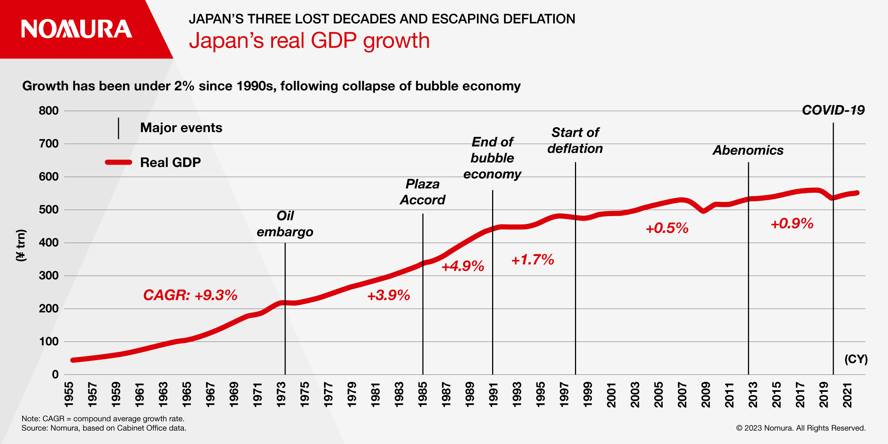
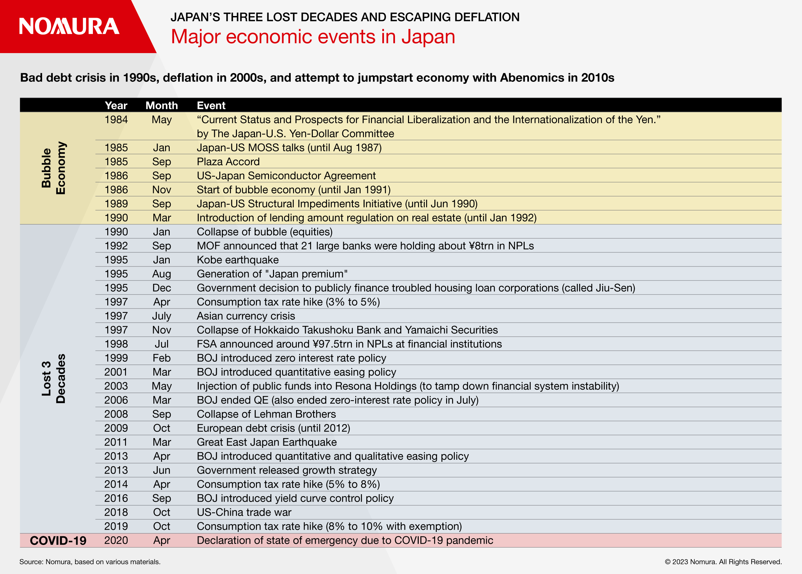
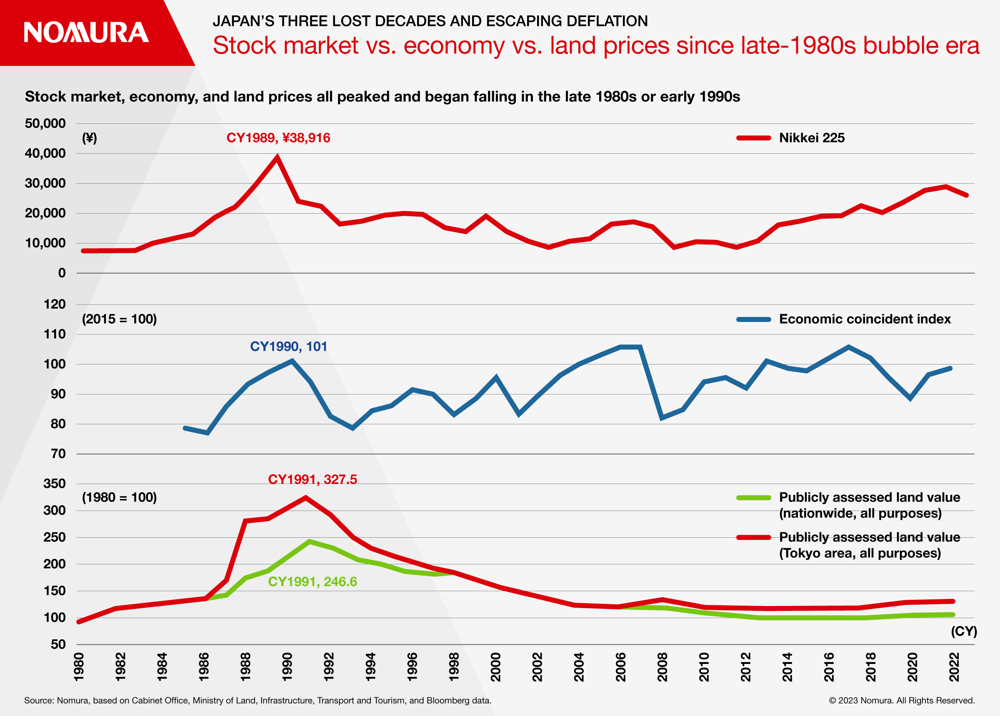
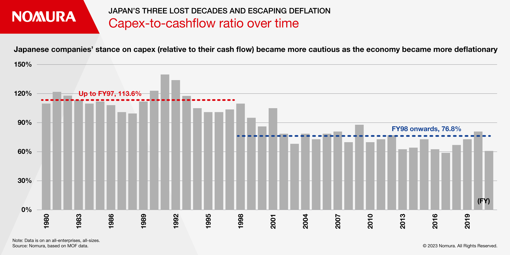
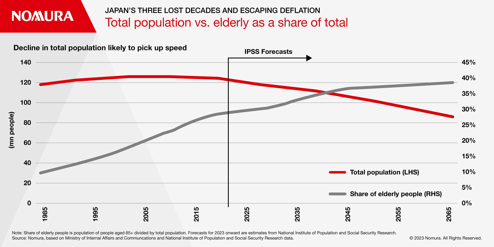

> **来源与授权｜Source and permission**
>
> **作者｜Authors：** Kyohei Morita、Takashi Miwa、Kohei Okazaki、Yuki Takashima、Uichiro Nozaki、Yuki Ito
>
> **原文标题｜Original title：** _Japan’s Three Lost Decades – Escaping Deflation_
>
> **原文发表于｜Originally published：** July 2023
>
> **原文链接｜Original article：** [Nomura Connects](https://www.nomuraconnects.com/focused-thinking-posts/japans-three-lost-decades-escaping-deflation/)
>
> **官方 PDF｜Official PDF：** [Japan’s Three Lost Decades – Escaping Deflation](https://d1qfwzw6aggd4h.cloudfront.net/about/Japan-Lost-Decades-Article-A4-v1.pdf)
>
> 本文经授权制作并发布中英双语版。英文正文按原文顺序保留，中文译文紧随相应段落；原文图表一并保留。｜This bilingual edition is reproduced and translated with permission. The English text follows the original order, with the Chinese translation immediately after each corresponding passage. The original figures are retained.

Investor interest in the Japanese economy is increasing globally, due to expectations of an end to deflation. Here we summarize the major events that led to a decades-long deflationary spiral.

> 随着人们期待日本结束通货紧缩，全球投资者对日本经济的兴趣日益升温。本文梳理了日本陷入长达数十年通缩螺旋的主要事件。

## Key takeaways

> **要点**

- The Japanese economy has picked up at times over the 30 years since its economic bubble burst
- Japan has been attracting global attention amid prolonged tension between the US and China due to its position as the only Asian member of the G7
- Large spring wage hikes may finally trigger a move out of deflation

> - 自经济泡沫破裂以来的 30 年间，日本经济曾数次出现复苏；
> - 在美中关系长期紧张的背景下，日本作为 G7 唯一的亚洲成员，正吸引全球关注；
> - 春季大幅加薪或许终于能够推动日本走出通缩。

Investor interest in Japan’s economy is increasing globally, due to expectations of an end to deflation, symbolized by the largest wage hikes for around 30 years and improvement in Japan’s relative position amid US-China tensions.

> 全球投资者对日本经济的兴趣正在上升。近 30 年来最大幅度的工资上涨，以及美中关系紧张之下日本相对地位的改善，都象征着结束通缩的希望。

To understand Japan’s next phase, we take a look back at how the only Asian country in the G-7 lost its position as the leading global economy.

> 为理解日本经济接下来将走向何方，我们先回顾这个 G7 唯一的亚洲国家如何失去了全球领先经济体的地位。

## Post-Plaza Accord Yen Appreciation — One Factor Behind Formation of Bubble Economy

> **广场协议后的日元升值——泡沫经济形成的一个因素**

After the post-war rapid growth phase from around 1955 through the first half of the 1970s, Japan’s economic growth gradually slowed. This slowdown reflected factors such as rebuilding the economy after World War II, progress in catching up with Western economies, and yen appreciation.

> 从 1955 年前后到 20 世纪 70 年代上半期，日本经历了战后高速增长，此后经济增速逐渐放缓。这种放缓反映了多个因素，包括二战后的经济重建告一段落、追赶西方经济体的进程取得进展，以及日元升值。

Following the shift to a floating exchange rate system in 1973, the 1985 Plaza Accord resulted in moves to weaken the dollar. Amid concern that the stronger yen might lead to an economic downturn, the Bank of Japan (BoJ) engaged in monetary easing and this is thought to have been one of the factors behind the formation of the bubble economy.

> 1973 年转向浮动汇率制度后，1985 年的《广场协议》推动美元走弱。由于担心日元升值可能引发经济衰退，日本银行实施了货币宽松政策；这被认为是泡沫经济形成的因素之一。

During this period, the Japanese economy benefited from low inflation despite the sharp rise in asset prices, partly because of the fall in crude oil prices.

> 在这一时期，尽管资产价格大幅上涨，日本经济仍受益于低通胀，其中一个原因是原油价格下跌。

However, share prices, the economy, and land prices started to fall after peaking at end 1989, end-1990 and end-1991, respectively. This marked the collapse of the bubble and the period from then up to the present is called the “lost three decades”.

> 然而，股价、经济景气和地价分别在 1989 年末、1990 年末和 1991 年末见顶，随后开始下跌。这标志着泡沫破裂；从那时延续至今的时期被称为“失去的三十年”。

## Japan Enters Deflation in 1998 Following NPL Problem

> **不良贷款问题之后，日本于 1998 年进入通缩**

From the end of the bubble through to around 1997, there were some periods of economic recovery. However, economic growth remained weak compared to the 1980s. As land prices continued to fall, the problem of nonperforming loans (NPLs) at financial institutions increased, resulting in a series of bankruptcies at major financial institutions.

> 从泡沫终结到 1997 年前后，日本也曾出现过几段经济复苏期。然而，与 20 世纪 80 年代相比，经济增长依然疲弱。随着地价持续下跌，金融机构的不良贷款问题日益严重，最终导致多家大型金融机构接连破产。

The consumption tax rate was increased from 3% to 5% in 1997, and the summer of that year also saw the Asian currency crisis, putting downward pressure on the Japanese economy from several directions. The period of “Japan as No. 1” was in the distant past as it entered a period of deflation in 1998, with negative GDP deflator growth.

> 1997 年，日本将消费税率从 3% 提高到 5%；同年夏天又爆发亚洲金融危机，多重力量共同对日本经济形成下行压力。“日本第一”的时代早已远去。1998 年，日本 GDP 平减指数同比转负，经济由此进入通缩时期。

## Unconventional Monetary Policy

> **非常规货币政策**

The BoJ embarked on a new phase in 1998 as it implemented independent and transparent policies under the new Bank of Japan Act. The BoJ gradually lowered its policy rate throughout the 1990s, introducing a zero interest rate policy in 1999. This marked the start of its unconventional monetary policy. Although the BOJ ended its zero-interest rate policy in 2000, it introduced quantitative easing in 2001 in the wake of the bursting of the IT bubble in the US.

> 1998 年，新《日本银行法》施行，日本银行开始以独立、透明的方式制定政策，由此进入一个新阶段。整个 20 世纪 90 年代，日本银行逐步下调政策利率，并于 1999 年推出零利率政策，开启了非常规货币政策。尽管日本银行在 2000 年结束零利率政策，但美国互联网泡沫破裂后，又于 2001 年实施量化宽松。

## Japan’s Unemployment Rate Reached Its Highest Post-War Level

> **日本失业率升至战后最高水平**

During this period, there was strong downward pressure on wages, with macro-level per-capita average wages falling year-on-year. This partly reflected a change in workforce composition, with a rise in the ratio of part-time workers, and base pay being frozen in around 2002.

> 这一时期，工资承受着强烈的下行压力，宏观层面的人均平均工资同比下降。部分原因在于劳动力结构发生变化：兼职劳动者占比上升，基本工资也在 2002 年前后被冻结。

However, China becoming part of the global economy might have put deflationary pressure on the Japanese economy by supplying cheap labor. The freeze in base pay was to some extent due to awareness of Japan’s international competitiveness being threatened by wages in Japan being too high. There was a clear change in the Japanese-style employment approach that considers it right that employment is long-term and stable.

> 与此同时，中国融入全球经济、提供廉价劳动力，也可能给日本经济带来通缩压力。冻结基本工资在一定程度上源于一种担忧：日本工资过高正在威胁其国际竞争力。以长期、稳定雇佣为正当原则的日式就业模式，也出现了明显变化。

## External Demand-Driven Economic Recovery in 2000s

> **21 世纪头十年由外需驱动的经济复苏**

The financial crisis of the second half of the 1990s ended in 2003 with the injection of public funds into Resona Holdings. The economy entered the Izanami Boom, the longest period of economic expansion in Japan’s postwar history (at that time). However, partly because of wages being curbed, there was only a muted recovery in private consumption, which accounts for around 60% of Japan’s GDP. Exports gained an increasing presence during this time. China’s position as the “factory of the world” had strengthened after it joined the World Trade Organization in 2001 and Japanese exports to China rose sharply, making Japan known as an economy driven by external demand. At the same time, China becoming part of the global economy put deflationary pressure on Japan by supplying cheap labor.

> 随着政府向 Resona Holdings 注入公共资金，20 世纪 90 年代后半期的金融危机于 2003 年告一段落。日本经济进入“伊邪那美景气”，这在当时是战后持续时间最长的一轮经济扩张。然而，工资受到抑制等因素使私人消费复苏乏力，而私人消费约占日本 GDP 的 60%。与此同时，出口的重要性不断上升。中国在 2001 年加入世界贸易组织后，作为“世界工厂”的地位进一步增强，日本对华出口大幅增长，日本也因此被称为由外需驱动的经济体。另一方面，中国融入全球经济并提供廉价劳动力，也给日本带来了通缩压力。

## Facing Deflation Again As A Result of Global Financial Crisis

> **全球金融危机使日本再度面临通缩**

The 2008 global financial crisis occurred as Japan’s economic recovery remained weak.

> 2008 年全球金融危机爆发时，日本的经济复苏依然疲弱。

The relatively low exposure of Japan’s financial sector to subprime-related products meant that there were no major bankruptcies. However, as economic growth in the 2000s was reliant on exports, there was still a downturn in Japan’s economy on the same scale as that seen in western countries. The Japanese economy once again faced deflation as the 2000s came to a close.

> 日本金融业对次贷相关产品的风险敞口相对较低，因此没有出现大型机构破产。然而，由于 21 世纪头十年的经济增长依赖出口，日本经济仍经历了与西方国家规模相当的衰退。随着这一年代接近尾声，日本经济再次面临通缩。

The excessively strong yen/weak dollar, with USD/JPY falling below 76 level, played a large role in the deflation seen at the time, along with the slide in demand accompanying the global recession.

> 除了全球衰退带来的需求下滑，日元过强、美元过弱也在当时的通缩中发挥了重要作用，美元兑日元一度跌破 76。

The already appreciating yen, relative to the US dollar, came under further appreciation pressure following the Fukushima Daiichi nuclear power plant accident. In autumn 2011, USD/JPY fell to an all-time low of 75.32.

> 福岛第一核电站事故发生后，原本相对美元已经升值的日元承受了更大的升值压力。2011 年秋季，美元兑日元跌至 75.32 的历史最低点。

## BOJ Purchases Assets

> **日本银行购买资产**

In response to this situation, the BOJ came up with its comprehensive monetary easing framework, under which it started purchasing long-term JGBs, corporate bonds, commercial paper, ETFs, and REITs. But the yen continued to strengthen against the dollar and core CPI inflation continued to trend in the vicinity of 0%.

> 为应对这一局面，日本银行推出全面货币宽松框架，开始购买长期日本国债、公司债、商业票据、ETF 和 REIT。然而，日元兑美元继续走强，核心 CPI 通胀率也继续在 0% 附近徘徊。

## Launch of Abenomics With Change In Administration At End-2012

> **2012 年末政权更迭，安倍经济学启动**

Change came in the latter half of 2012 with the economic policies of Prime Minister Abe (Abenomics). They consisted of a bold monetary policy — in the form of quantitative and qualitative easing — a flexible fiscal policy, and a growth strategy to stimulate private investment.

> 2012 年下半年，安倍首相推出的经济政策——“安倍经济学”——带来了变化。其内容包括：以量化与质化宽松为形式的大胆货币政策、灵活的财政政策，以及刺激私人投资的增长战略。

In response to the quantitative and qualitative easing, land and real estate prices rose moderately. Expectations of a rise in consumer prices also grew as population decline led to labor shortages.

> 在量化与质化宽松的作用下，土地和房地产价格温和上涨。随着人口减少造成劳动力短缺，人们对消费价格上涨的预期也有所增强。

The Japanese economy thus looked as though it had taken a firm step toward ending deflation. However, the economic recovery abruptly lost speed when the government hiked the consumption tax rate from 5% to 8% in April 2014. Then BOJ Governor Haruhiko Kuroda committed the BOJ to achieving 2% inflation, but the target of stable inflation was gradually pushed further into the future.

> 日本经济由此看似朝着结束通缩迈出了坚实一步。然而，政府在 2014 年 4 月将消费税率从 5% 提高到 8% 后，经济复苏突然失速。时任日本银行行长黑田东彦承诺实现 2% 的通胀目标，但稳定实现这一目标的时间不断被推迟。

Recognizing this as a problem, the BOJ sprang the huge surprise of negative interest rates in January 2016, leading to widespread disruption; JGB yields fell sharply and the yield curve flattened.

> 日本银行意识到问题所在，于 2016 年 1 月出人意料地推出负利率，引发广泛震荡；日本国债收益率大幅下降，收益率曲线趋于平坦。

This substantially damaged investment opportunities for ultra-long investors such as pension funds and life insurers. Banks and other financial institutions also had to modify their systems in order to deal with negative interest rates. In response, the BOJ introduced its yield curve control policy in September 2016, which is still in place today.

> 这严重损害了养老基金和寿险公司等超长期投资者的投资机会。银行及其他金融机构也不得不改造系统，以应对负利率。作为回应，日本银行于 2016 年 9 月引入收益率曲线控制政策；截至原文发表时，该政策仍在实施。

## Highest Inflation Since The 1980s, Largest Wage Hikes Since First Half of The 1990s

> **20 世纪 80 年代以来最高通胀，90 年代上半期以来最大幅度加薪**

Energy, food, and forex dealt a triple whammy of inflationary pressures to Japan’s economy. Core CPI inflation came in at +4.2% y-y in January 2023, its highest level since September 1981.

> 能源、食品和汇率三重因素共同给日本经济带来通胀压力。2023 年 1 月，核心 CPI 同比上涨 4.2%，创 1981 年 9 月以来最高水平。

Meanwhile, the sixth set of data compiled by the Japanese Trade Union Confederation (Rengo) on spring wage negotiations showed base pay growth accelerating sharply to 2.14%, its highest level since the first half of the 1990s.

> 与此同时，日本劳动组合总联合会（Rengo）汇总的第六轮春季工资谈判数据显示，基本工资增幅迅速加快至 2.14%，为 20 世纪 90 年代上半期以来的最高水平。

While much of the spring wage hike in 2023 was to offset inflation, it cannot be explained by faster inflation alone, suggesting that upward pressures on wages as a result of accelerating population decline have finally started to make themselves felt more strongly.

> 尽管 2023 年春季加薪很大程度上是为了抵消通胀，但仅凭通胀加速并不足以解释全部涨幅。这表明，人口加速减少所带来的工资上行压力，或许终于开始更强烈地显现出来。
