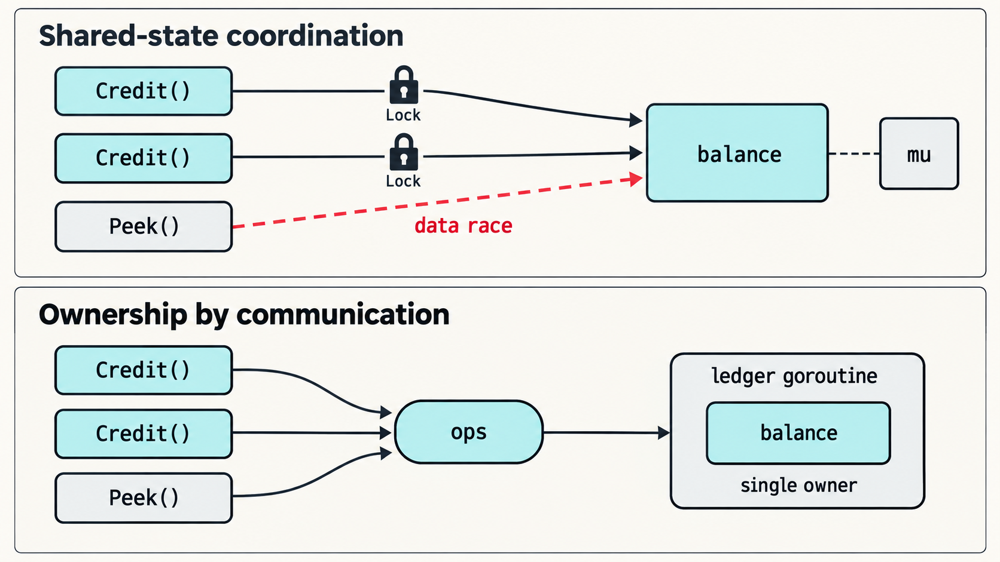
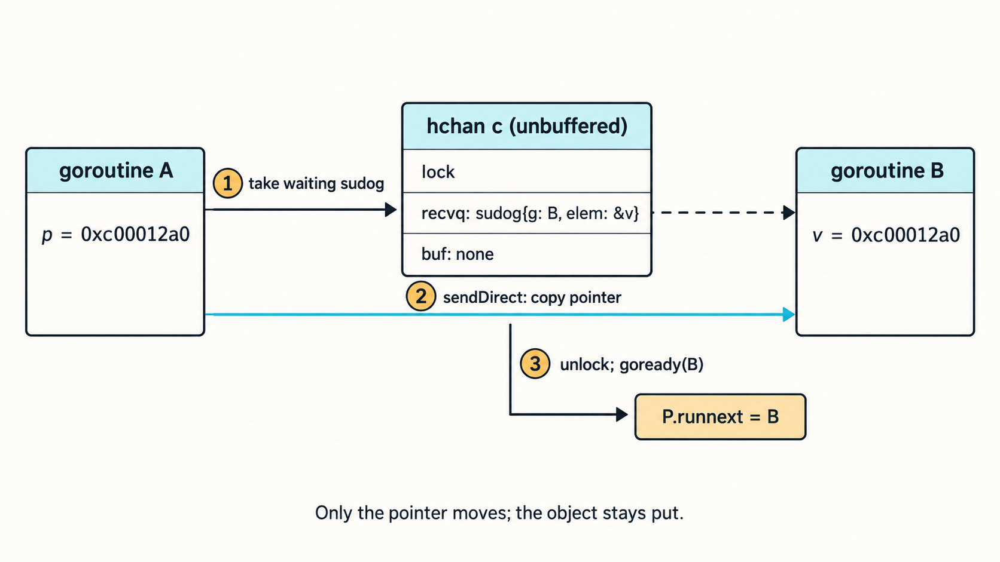
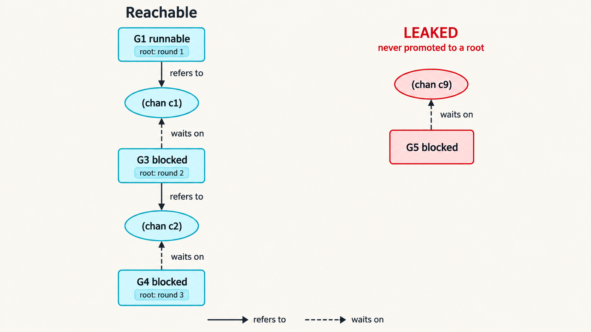

Go 最著名的格言究竟主张什么，以及十八年来的规范草案、内存模型规则、运行时代码、编译器处理过程和工具如何把它从一句口号变成机器机制。下文的每一项主张都经过 Go 仓库核对。

源码快照：标签 `go1.27.1`（`862c888e61`）以及 2026 年 9 月 24 日的 master（`8190b02cec`）· 阅读约 30 分钟

> “不要通过共享内存来通信，而应该通过通信来共享内存。”
>
> ——《Effective Go》“Share by communicating”一节。Russ Cox 于 2009 年 6 月 25 日把这句话写入初稿（[`94439982b6`](https://github.com/golang/go/commit/94439982b6)）；同年 10 月，Rob Pike 写成了它所在的整节内容（[`430d462391`](https://github.com/golang/go/commit/430d462391)）。

**目录**

- [这句话究竟主张什么](#这句话究竟主张什么)
- [channel 先于格言出现](#channel-先于格言出现)
- [这句格言写在何处](#这句格言写在何处)
- [语言：让交接成为一等操作](#语言让交接成为一等操作)
- [内存模型：通信就是同步](#内存模型通信就是同步)
- [运行时：一把锁、一个队列和一条捷径](#运行时一把锁一个队列和一条捷径)
- [编译器：发送就是共享边界](#编译器发送就是共享边界)
- [护栏：检查这项约定](#护栏检查这项约定)
- [标准库以 channel 说话](#标准库以-channel-说话)
- [格言，而非法律](#格言而非法律)
- [通信的代价](#通信的代价)
- [重新表述这句格言](#重新表述这句格言)
- [时间线](#时间线)
- [来源与方法](#来源与方法)
- [译者补充与技术校注](#译者补充与技术校注)

---

## 这句话究竟主张什么

**主要来源：`doc/go_spec.html`，Go statements**

这句格言常被压缩成“channel 优于 mutex”。这个说法得到的结论大致正确，理由却错了；而 Go 的设计恰恰存在于理由之中。

先说 Go 没有做什么：它没有隔离 goroutine。从 2008 年 3 月 4 日的规范草案开始，`go` 语句就在程序的同一地址空间内启动一条新的控制线程；Go 1.27 规范至今仍以几乎相同的措辞这样描述（[`73823d236a`](https://github.com/golang/go/commit/73823d236a)；

[`go_spec.html:6967`](https://github.com/golang/go/blob/go1.27.1/doc/go_spec.html#L6962-L6967)）。

channel 也不会复制指针所指向的内容：发送一个 `*Order`，传输的是一个机器字，而不是那份订单。Rob Pike 在后来整理为 [“Go at Google”](https://go.dev/talks/2012/splash.article) 的 SPLASH 2012 主题演讲中也承认这一点：Go 并没有从构造上保证并发程序的内存安全；goroutine 可以合法地共享数据，通过 channel 发送指针既正常又廉价。

他写道，Go 所依赖的是约定：程序员学会把消息传递当作控制所有权的一种方式。

所以，这句格言讨论的不是内存是否共享，而是共享内存的访问权如何易手。仔细读，它把三件事融合进同一个操作：

- **传输。** 一个值从一个 goroutine 移到另一个。对于指针，对象仍留在原处；移动的是使用它的权利。
- **同步。** 传输本身就是同步事件。发送者在发送之前完成的一切，对接收者在接收之后都是可见的，不需要其他机制。
- **所有权。** 交接以后，发送者停止接触数据，因此在任何时刻都只有一个 goroutine 对它负责。

“通过共享内存来通信”则是相反的安排。goroutine 通过读写共同变量进行协调；使之正确的锁，仅凭一条注释，以及所有人在每一个访问位置上的自觉，与数据绑定在一起。下面用两种方式编写同一份账本。

**通过共享内存来通信**

```go
type Ledger struct {
	mu      sync.Mutex
	balance map[string]int64 // guarded by mu（只写在注释里）
}

func (l *Ledger) Credit(acct string, delta int64) int64 {
	l.mu.Lock()
	defer l.mu.Unlock()
	l.balance[acct] += delta
	return l.balance[acct]
}

// 几个月后增加。它可以编译、通过评审，却会发生数据竞争。
func (l *Ledger) Peek(acct string) int64 {
	return l.balance[acct]
}
```

**通过通信共享内存**

```go
type op struct {
	acct  string
	delta int64
	reply chan<- int64 // 新余额从这里返回
}

// ledger 拥有 balance。其他 goroutine 无法触及这个 map，
// 所以不会有其他 goroutine 与它竞争。
func ledger(ops <-chan op) {
	balance := make(map[string]int64)
	for o := range ops {
		balance[o.acct] += o.delta
		o.reply <- balance[o.acct]
	}
}
```



图 1（Image Gen 版）：上半部分展示多个访问点共同操作 `balance`，其中一个遗漏锁便形成数据竞争；下半部分展示请求经 `ops` channel 进入唯一的 `ledger goroutine`，由它独占 `balance`。

**原文本图（保留用于对比）**

```text
通过共享内存来通信：3 个位置，每处都必须加锁

  Credit() ─── Lock/Unlock ───▶ ┌──────────────────┐
                                │                  │
  Credit() ─── Lock/Unlock ───▶ │     balance      │
                                │ map[string]int64 │
  Peek()   ─ ─ ─ 未加锁 ─ ─ ─ ─▶ │                  │
              （数据竞争！）     └────────┬─────────┘
                                         ┆
                                      ┌──┴──┐
                                      │ mu  │  保护 balance，
                                      └─────┘  但只写在注释里
```

```text
通过通信共享内存：3 个发送者，1 个所有者

  Credit() ──┐                             ┌──────────────────────┐
             │                             │ ledger goroutine     │
  Credit() ──┼── ops <- op ──▶ ( ops ) ──▶ │  ┌────────────────┐  │
             │                             │  │    balance     │  │
  Peek()   ──┘                             │  └────────────────┘  │
                                           │  只在这里访问         │
                                           └──────────────────────┘
```

图 1（原文本图说明）：同一份账本的两种写法。上图：正确性依赖每个访问位置都遵守加锁协议，一个忘记加锁的 `Peek` 就会造成编译器看不见的数据竞争。下图：map 被限制在一个 goroutine 中，调用者只能向它发送请求；回复通过每请求一个的 channel 返回，此处省略。

两种版本都可以是正确的。区别在于，必须在哪些地方论证正确性。使用 mutex 时，每次访问 `balance` 都必须遵守协议；漏掉一次，就会形成数据竞争，却不会有编译错误提醒你。使用所有者 goroutine 时，map 从未离开该 goroutine；影响它的唯一方式是发送消息，同步也随消息一起完成。

### 为什么一次交接就够了

这种纪律能够排除数据竞争的主张来自 Go 内存模型，值得完整看一次证明。假设 goroutine A 通过指针 `p` 写入数据，随后在 channel `c` 上发送 `p`；goroutine B 接收它，再通过它读取数据。

1. A 的写入在 A 的发送之前发生，这是同一 goroutine 内的程序顺序。
2. 发送同步先于对应接收的完成，这是内存模型的第一条 channel 规则（[`go_mem.html:373`](https://github.com/golang/go/blob/go1.27.1/doc/go_mem.html#L373-L374)）。
3. B 完成接收，在 B 的读取之前发生。
4. happens-before 具有传递性，因此 A 在发送前完成的每一次写入，都先发生于 B 在接收后进行的每一次读取。

如果 A 确实放手，发送后不再访问 `*p`，那么每一次交接都会把前一任所有者的全部访问排在后一任所有者的全部访问之前。没有两次访问并发发生，因此不存在数据竞争；自 2022 年修订后，内存模型还保证无数据竞争的程序表现得仿佛顺序一致地执行（[`865911424d`](https://github.com/golang/go/commit/865911424d)）。这就是《Effective Go》断言这种风格从设计上排除了数据竞争背后的精确含义。

一切都取决于 A 真正放手，而 Go 的类型系统并不强制这一点。下面的代码可以毫无怨言地通过编译：

```go
func produce(out chan<- *Order) {
	o := &Order{ID: 42}
	out <- o          // 所有权已经交给接收者……
	o.Status = "sent" // ……发送者却继续写入：数据竞争
}
```

这道缺口贯穿本文余下部分。Go 的历史可以被读作一个长期而审慎的工程：在不把这句格言变成强制规则的前提下，把它从约定逐步变成机器机制——写进规范、内存模型、运行时、编译器、工具和标准库。

---

## channel 先于格言出现

**主要来源：`doc/go_spec`，2008 年 3 月至 9 月**

在四次带有玩笑意味的提交中，仓库重现了 Brian Kernighan 从 1972 年到 1988 年的“hello, world”；此后，真正的历史从 Robert Griesemer 于 2008 年 3 月 2 日提交的第一份规范开始。

它列出的简短目标已经包括语言级多线程支持，并预留了题为“Multithreading and channels”的一节，唯一内容是一个方括号中的请求：请 Rob Pike 来写（[`18c5b488a3`](https://github.com/golang/go/commit/18c5b488a3)）。

同日的第二次提交定义了 channel 类型。最初的定义就让 channel 同时为一对并发运行的函数承担两项职责：在它们之间携带值，并使它们同步（[`328df636c5`](https://github.com/golang/go/commit/328df636c5)）。在 Go 的线程甚至还没有名字时，格言的三个组成部分中已经有两个——传输与同步——合并成了同一个概念。“goroutine”一词直到 7 月实现它们的提交中才首次出现。

模型的其余部分在几周内陆续到位：

- **3 月 4 日：** `go` 语句，在同一地址空间内把函数作为独立控制线程启动。它的两个示例 `go Server()`，以及一个永远休眠并向 channel 发送 `true` 的闭包，至今仍在规范中（[`73823d236a`](https://github.com/golang/go/commit/73823d236a)）。
- **3 月 11 日：** 草案中唯一完整的程序变成并发素数筛。一个生成器 goroutine 向雏菊链状的过滤 goroutine 供数；每个过滤器保存自己的素数，只通过 channel 与相邻过滤器通信（[`0d1e90be17`](https://github.com/golang/go/commit/0d1e90be17)）。

同一个程序至今仍在规范结尾（[`go_spec.html:8131`](https://github.com/golang/go/blob/go1.27.1/doc/go_spec.html#L8131)）。

- **3 月 27 日：** Rob Pike 加入 `select`：从就绪 case 中作统一公平选择、提供 `default` 子句，并把 nil channel 当作不存在的 case。三条规则沿用至今（[`8c1408dd8e`](https://github.com/golang/go/commit/8c1408dd8e)）。

素数筛像一块很好的化石。十八年来，它的结构没有变化，只是拼写变了。

|              | 2008 年 3 月草案          | Go 1.27 规范                 |
| ------------ | ------------------------- | ---------------------------- |
| 只发送参数   | `*chan> int`              | `chan<- int`                 |
| 只接收参数   | `*chan< int`              | `<-chan int`                 |
| 发送         | `>ch = i`                 | `ch <- i`                    |
| 接收         | `i := <in`                | `for i := range src`         |
| 创建 channel | `new(chan int)`，一个指针 | `make(chan int)`，一个引用值 |

`<-` 操作符于 2008 年 9 月 17 日加入（[`2902a82ca4`](https://github.com/golang/go/commit/2902a82ca4)）；`make` 于 2009 年 1 月 6 日加入（[`633957bcce`](https://github.com/golang/go/commit/633957bcce)）。

实现于同年夏天跟进，由 Ken Thompson 用 C 写成：7 月 11 日加入带分段栈的 goroutine（[`751ce3a77a`](https://github.com/golang/go/commit/751ce3a77a)）；7 月 13 日加入 channel；

7 月 14 日实现同步会合——发送者发现有接收者等待时，把值复制给它并把它标为可运行（[`526200345c`](https://github.com/golang/go/commit/526200345c)）。带缓冲 channel 在同日晚些时候加入。

`select` 在 7 月 20 日至 25 日间落地，从随机位置开始遍历 case（[`949ab5c7ff`](https://github.com/golang/go/commit/949ab5c7ff)）。

7 月 18 日，Pike 签入一项至今仍留在源码树中的 channel 测试：Doug McIlroy 最早用 Newsqueak 编写的幂级数包（[`f87a960adf`](https://github.com/golang/go/commit/f87a960adf)；[`test/chan/powser1.go`](https://github.com/golang/go/blob/go1.27.1/test/chan/powser1.go#L9-L13)）。

8 月 4 日，Russ Cox 的第一个多线程运行时加入了一项检查：当所有 goroutine 都已休眠时停止程序。这项检查至今仍在（[`d28acc42ec`](https://github.com/golang/go/commit/d28acc42ec)）。

幂级数指出了这条血统。FAQ 把 Newsqueak 和 Limbo——两者都受 Hoare 的 CSP 启发——列为 Go 并发设计的来源（[FAQ：ancestors](https://go.dev/doc/faq#ancestors)）。

Pike 2012 年的 [Go Concurrency Patterns](https://go.dev/talks/2012/concurrency.slide) 演讲说得更具体：Go 是 Newsqueak—Alef—Limbo 这一支的最新成员，其特别之处是把 channel 当作一等值；而更接近原始 CSP 的 Erlang 则按名字寻址进程。

他把二者比作给文件命名与持有文件描述符。这个差异塑造了这句格言。因为你持有的是 channel 而非 goroutine，所以可以把 channel 作为参数传递、存入结构体、通过另一个 channel 发送、限制方向并关闭。谁持有哪一端，就能用来描述所有权。

---

## 这句格言写在何处

**主要来源：《Effective Go》、`src/sync`、`src/sync/atomic`**

这项指导比这句口号更早。2009 年 3 月 4 日，Russ Cox 把 `sync` 包描述为一组供底层库代码使用的基本原语，并建议在更高层次使用 channel 和通信（[`8ba287585a`](https://github.com/golang/go/commit/8ba287585a)）。

除了后来为 `Once` 和 `WaitGroup` 加入的例外，这段话至今仍是包注释的一部分。这个例外是在 2011 年 2 月 `WaitGroup` 加入时写入的（[`63457d089e`](https://github.com/golang/go/commit/63457d089e)；

[`src/sync/mutex.go:5–8`](https://github.com/golang/go/blob/go1.27.1/src/sync/mutex.go#L5-L8)）。

这句话本身首次出现于 2009 年 6 月 25 日 Russ Cox 提交的第一版《Effective Go》中：Concurrency 一章、以这句口号命名的一节、口号本身，以及一项承诺补充更多内容的占位符（[`94439982b6`](https://github.com/golang/go/commit/94439982b6)）。

Rob Pike 于 10 月 20 日写成了这一节（[`430d462391`](https://github.com/golang/go/commit/430d462391)）。

他所写的内容，实质上就是今天 [《Effective Go》](https://go.dev/doc/effective_go#sharing)仍在说的内容；这份文档于 2021 年移入 `golang/website` 仓库。它依次作出四层论述。

共享值在 channel 上传递，因此任何时刻只有一个 goroutine 能够访问它。这种方法可能被用过头：引用计数也许最好由一把 mutex 保护一个整数。接下来是一个思想实验：两个单线程程序各自不需要锁，如果通信本身就是同步器，那么把它们连接起来以后仍然不需要锁。最后是谱系：CSP，或者同样可以理解为 Unix 管道的类型安全后代。三周后的 2009 年 11 月 10 日，Go 正式开源。

此后，这句格言传播到整个源码树中：

- **进入 `sync/atomic`。** Russ Cox 于 2011 年 2 月 25 日创建这个包时，其文档警告这些函数很容易被误用；除了特殊的底层场景，channel 或 `sync` 包才是更好的工具。文档最后逐字写下这句格言（[`22eab1f5c7`](https://github.com/golang/go/commit/22eab1f5c7)）。

它今天仍在那里（[`src/sync/atomic/doc.go:11–12`](https://github.com/golang/go/blob/go1.27.1/src/sync/atomic/doc.go#L8-L12)）。暴露最原始共享内存操作的包，把这句格言贴成了警告标签。

- **进入代码导读与博客。** Andrew Gerrand 于 2010 年 6 月 30 日提交的[代码导读](https://go.dev/doc/codewalk/sharemem/)（[`71675c6fa0`](https://github.com/golang/go/commit/71675c6fa0)），以及 7 月 13 日发布的 [Go 博客文章](https://go.dev/blog/codelab-share)，

标题都是“Share Memory By Communicating”。代码导读明确采用一项约定：发送指针的人放弃其背后的数据，接收指针的人接管它。

- **进入 go 命令的测试数据。** 虚构模块 `rsc.io/quote` 的固件以 23 个版本存在于 `cmd/go/testdata` 中，它的 `Go` 函数返回的正是这句格言（[`rsc.io_quote_v1.5.2.txt:46–48`](https://github.com/golang/go/blob/go1.27.1/src/cmd/go/testdata/mod/rsc.io_quote_v1.5.2.txt#L46-L48)）。无论模块测试还在检验什么，它们传递的字符串就是这一句。

---

## 语言：让交接成为一等操作

**主要来源：`doc/go_spec.html`，Channel types、Select statements、Close**

Go 没有所有权类型，因此它的类型系统不能说出谁拥有一个值。语言所能做的，是让传输操作成为一等的、有类型的、廉价的操作，并移除那些容易诱使人用共享状态思考的替代形式。规范的历史同时展示了这两方面。

- **channel 携带类型和方向。** `chan T` 可以隐式转换为 `chan<- T` 或 `<-chan T`；持有只接收端的代码既不能向它发送，也不能关闭它。关闭一个只接收 channel 从 2011 年 10 月起就是编译错误（[`f58ed4e641`](https://github.com/golang/go/commit/f58ed4e641)），从而把流结束信号留给发送方。
- **channel 是规范明确声明可安全并发使用的唯一内置类型。** 2013 年 8 月，为 Go 1.2，Rob Pike 增加了两句话：channel 是先进先出的，任意数量的 goroutine 都可以在不需要进一步同步的情况下发送、接收和调用 `len` 或 `cap`（[`bd65404eef`](https://github.com/golang/go/commit/bd65404eef)；

[`go_spec.html:1759–1771`](https://github.com/golang/go/blob/go1.27.1/doc/go_spec.html#L1759-L1771)）。规范没有对 map 作出类似保证。

自 2009 年 9 月起，[FAQ](https://go.dev/doc/faq#atomic_maps) 就解释说，map 操作被有意保留为非原子操作：大多数 map 不共享，如果每次访问都加锁，会让所有程序都付出代价（[`8796e8ce1e`](https://github.com/golang/go/commit/8796e8ce1e)）。

- **不阻塞只有一种写法。** 2011 年初以前，Go 曾有非阻塞发送和接收操作符：把发送当作布尔表达式使用，以及立即返回的双值接收。2011 年 2 月 1 日的周版本移除了它们，并指出，带 `default` 子句的 `select` 一直都能表达同一件事（[`19d9a40845`](https://github.com/golang/go/commit/19d9a40845)）。如今，所有非阻塞通信都写成 `select`。
- **关闭状态与数据一起到达。** 几周以后，`closed` 内置函数被移除，由双值接收 `v, ok := <-c` 取代；`ok` 表示 `v` 是否来自一次真实发送（[`9f2cb86fe2`](https://github.com/golang/go/commit/9f2cb86fe2)）。提交只记录了改动，没有记录理由，但效果很清楚：单独查询 `closed(c)` 是对共享状态的“先检查、后行动”，答案在使用时可能已经过期；新形式让关闭成为通信本身的一部分。
- **nil channel 永远不会通信。** 从 Pike 最初加入 `select` 开始，nil channel 就从未处于就绪状态；因此，一旦某个输入源耗尽，把 channel 变量设为 nil 就成为关闭一个 `select` 分支的惯用方法。
- **定义变得通用而精确。** 2014 年 5 月，为 Go 1.3，Robert Griesemer 重写了 channel 定义。旧措辞描述两个函数同步并传递一个值；新措辞则允许任意数量的并发执行函数发送和接收值（[`97aa90d251`](https://github.com/golang/go/commit/97aa90d251)）。同步语义如今统一放在内存模型中。
- **规范准确说明了共享什么。** 2024 年 12 月为 Go 1.24 增加的一节明确指出：指针、函数、slice、map 和 channel 含有对底层数据的引用，其他值可以共享这些数据；array、struct 和基本值则是自包含的（[`0d8aa8cce6`](https://github.com/golang/go/commit/0d8aa8cce6)）。这正是格言中“共享”的边界。

发送由普通值组成的 struct，接收者得到自己的副本；发送 slice 或指针，接收者得到的是访问权。

- **泛型让 channel 代码保持可复用。** 自 Go 1.18 起，一个泛型 merge 或 fan-out 阶段可以服务于所有元素类型。类型为类型参数的 channel 上允许什么操作，由类型集决定：集合中的每种类型都必须是允许该操作、且元素类型相同的 channel。Go 1.25 在不再使用旧“核心类型”概念的情况下重新表述了这些规则（[`434de2f8e9`](https://github.com/golang/go/commit/434de2f8e9)）。

---

## 内存模型：通信就是同步

**主要来源：`doc/go_mem.html`，Channel communication**

一句口号不能让程序正确，内存模型可以。Russ Cox 于 2009 年 2 月起草 Go 内存模型，比公开发布早九个月。它的 channel 一节开篇便把 channel 通信称为 goroutine 之间的主要同步方式（[`82c38cf8dd`](https://github.com/golang/go/commit/82c38cf8dd)）。

今天仍然如此开篇（[`go_mem.html:366`](https://github.com/golang/go/blob/go1.27.1/doc/go_mem.html#L363-L369)）。

四条规则把通信变成 happens-before 边。下表是这些规则的转述，以及它们进入文档的时间：

| 规则（转述）                                                     | 开始时间                                                                               | 得到了什么                                           |
| ---------------------------------------------------------------- | -------------------------------------------------------------------------------------- | ---------------------------------------------------- |
| 一次发送同步先于对应接收的完成。                                 | 2009 年 2 月草案                                                                       | 交接：发送前的写入在接收后可见。                     |
| 在无缓冲 channel 上，一次接收同步先于对应发送的完成。            | 2009 年 2 月草案                                                                       | 会合会通知双方；发送者得知接收者已经到达。           |
| 关闭 channel 同步先于任何因 channel 已关闭而返回零值的接收。     | 2011 年 5 月（[`9f03d4a3f7`](https://github.com/golang/go/commit/9f03d4a3f7)）         | `close` 是广播：每个接收者都能看到关闭之前发生的事。 |
| 容量为 C 的 channel 上，第 k 次接收同步先于第 k+C 次发送的完成。 | 2014 年 3 月，Go 1.3（[`132e816734`](https://github.com/golang/go/commit/132e816734)） | 带缓冲 channel 可以用作计数信号量。                  |

最后一条规则的提交说明很有启发性。团队曾公开表示信号量惯用法是有效的，却从未把规则写下来，所以这次提交把它写了下来。整段历史都呈现同一种模式：实践在先，保证在后。

后来的两次修订改变了这份文档的气质。2014 年 10 月，Rob Pike 在开头加入简短的建议（[`2eb1b65830`](https://github.com/golang/go/commit/2eb1b65830)）：当多个 goroutine 在数据被修改时访问它，必须用 channel 操作，或者 `sync`、`sync/atomic` 中的原语串行化访问；如果读者必须看完文档余下内容才能理解自己的程序，那就是过于聪明了。

2022 年，为 Go 1.19，Russ Cox 参照 Boehm 和 Adve 为 C++ 提出的模型，对内存模型进行了形式化重写。修订定义了数据竞争，向无数据竞争程序保证顺序一致性，赋予 `sync/atomic` 顺序一致语义，并描述带有数据竞争的程序可能发生什么（[`865911424d`](https://github.com/golang/go/commit/865911424d)）。

最后一点在这里很重要。interface、slice、string 或 map 等多字值上的竞争可能观察到撕裂值；内存模型警告，这可能导致任意内存损坏（[implementation restrictions](https://go.dev/ref/mem#restrictions)）。在 Go 中，通过共享内存进行粗心的通信不仅是逻辑错误，还可能破坏内存安全。

下面是关闭规则的实际运用：发布一份配置。

```go
var cfg *Config

func load(ready chan<- struct{}) {
	cfg = parse("app.toml") // (1) 普通写入
	close(ready)            // (2)
}

func serve(ready <-chan struct{}) {
	<-ready                 // (3) 因 ready 关闭而返回
	listen(cfg.Addr)        // (4) 保证能看见 (1)
}
```

（1）在（2）之前发生；（2）同步先于（3），因为（3）因关闭而返回；（3）又在（4）之前发生。因此，（4）能看到解析后的配置。把 channel 换成布尔标志，程序就会产生数据竞争。内存模型的错误同步一节解释了问题：看到标志，甚至看到新指针，都不意味着能看到初始化其所指对象的写入。

---

## 运行时：一把锁、一个队列和一条捷径

**主要来源：`src/runtime/chan.go`、`select.go`、`proc.go`**

channel 并不神奇。在运行时中，它是一个 `hchan`：由锁保护的环形缓冲区，加上两个停驻 goroutine 队列（[`chan.go:34–55`](https://github.com/golang/go/blob/go1.27.1/src/runtime/chan.go#L34-L55)）。

| 字段                          | 保存的内容                                                                                                                                      |
| ----------------------------- | ----------------------------------------------------------------------------------------------------------------------------------------------- |
| `qcount`、`dataqsiz`          | 当前缓冲的元素数；缓冲容量，无缓冲时为 0                                                                                                        |
| `buf`、`elemsize`、`elemtype` | 环形缓冲区，以及用于复制进出值的元素类型                                                                                                        |
| `sendx`、`recvx`              | 下一次发送和下一次接收在环形缓冲区中的位置                                                                                                      |
| `recvq`、`sendq`              | `sudog` 队列，即停驻的接收者和发送者的等待记录                                                                                                  |
| `closed`                      | 由 `close` 设置一次                                                                                                                             |
| `timer`                       | 自 Go 1.23 起：向 `time.Timer` 或 `time.Ticker` channel 供数的运行时 timer（[`508bb17edd`](https://github.com/golang/go/commit/508bb17edd)）    |
| `bubble`                      | 自 Go 1.25 起：channel 所属的 `testing/synctest` bubble；Go 1.24 使用一个标志（[`0afcf9192c`](https://github.com/golang/go/commit/0afcf9192c)） |
| `lock`                        | 保护上述全部字段的运行时 mutex                                                                                                                  |

所以，这句格言没有消灭锁。它把锁移入一个小巧、经过严密评审的抽象，再把一个内置同步的操作交给用户代码。FAQ 对 CSP 的回答也作了同样说明：即便底层存在 mutex，更高层接口的意义仍在于让代码更简单（[FAQ：CSP](https://go.dev/doc/faq#csp)，首次写于 2009 年 9 月，[`5b79202ca2`](https://github.com/golang/go/commit/5b79202ca2)）。

`chan.go` 顶部的注释列出了让余下实现成立的不变量（[`chan.go:9–18`](https://github.com/golang/go/blob/go1.27.1/src/runtime/chan.go#L9-L18)）。两个等待队列中至少有一个始终为空；唯一例外，是同一个 `select` 在同一无缓冲 channel 上既发送又接收。在带缓冲 channel 上，缓冲区中有数据意味着没有接收者等待；

缓冲区有空位意味着没有发送者等待。因此，如果有接收者在等，缓冲区就是空的，发送者可以绕过它。

### 逐步完成交接

这条捷径是代码库对这句格言最字面的实现。当 `chansend` 取得 channel 锁并发现一个停驻的接收者时（[`chan.go:230`](https://github.com/golang/go/blob/go1.27.1/src/runtime/chan.go#L228-L233)），它把值交给 `send`。该函数把值直接复制到接收者登记在 `sudog` 中的位置——通常是接收者自己栈上的变量——然后释放锁并使接收者就绪。

`sendDirect` 上方的注释指出，在运行时中，无缓冲或空缓冲 channel 上的发送和接收，是一个正在运行的 goroutine 写入另一个 goroutine 栈的唯一操作（[`chan.go:382`](https://github.com/golang/go/blob/go1.27.1/src/runtime/chan.go#L382-L390)）。这个场景特殊到垃圾回收器需要专用写屏障；

它于 2015 年 6 月为 Go 1.5 加入（[`80ec711755`](https://github.com/golang/go/commit/80ec711755)）。



图 2（Image Gen 版）：发送方取出等待中的 `sudog`，`sendDirect` 把指针复制到接收方登记的位置，随后解锁并通过 `goready` 让接收方就绪。移动的是指针，不是它指向的对象。

**原文本图（保留用于对比）**

```text
  goroutine A（运行中）           goroutine B（停驻在 chanrecv）
  ┌────────────────────┐          ┌────────────────────┐
  │ p = 0xc00012a0     │───(2)───▶│ v = 0xc00012a0     │
  └─────────┬──────────┘sendDirect└──────────────▲─────┘
            │                                    ┆
            │ (1) 锁定 c，取出 B 的 sudog         ┆ elem = &v
            ▼                                    ┆
  ┌──────────────────────────────────────────────┴───────┐
  │ hchan c（无缓冲）                            ┆       │
  │   lock    A 在 (1) 与 (2) 期间持有             ┆       │
  │   recvq   sudog{g: B, elem: &v} ┄┄┄┄┄┄┄┄┄┄┄┄┄┘       │
  │   buf     无（dataqsiz 0）                           │
  └─────────┬────────────────────────────────────────────┘
            │ (3) 解锁 c；goready(B)
            ▼
  ┌─────────────────┐
  │ P.runnext = B   │  B 接下来运行，并继承 A 的时间片
  └─────────────────┘

  p 和 v 现在保存相同的地址：堆上同一个 Order{ID: 42}。
  移动的只有指针。B 拥有 Order；A 必须停止使用 p。
```

图 2（原文本图说明）：当 A 执行 `c <- p`、而 B 停驻在 `v := <-c` 时，`chansend` → `send` → `sendDirect` 中发生的直接交接。只有指针的字节从 A 的栈移动到 B 的栈；`Order` 留在原处。A 仍保留一份指针副本；要求 A 停止使用它的是约定，而非编译器。第（3）步把 B 放入 `runnext`，让接收者接下来在同一个处理器上运行。

这种形态与语言本身一样古老。Ken Thompson 2008 年 7 月的会合实现会把值复制给等待中的接收者，并将其标为可运行。Go 1.0 的 C 实现（2012 年）已经拥有与今天相同的 `Hchan` 字段，也会在无缓冲 channel 上直接复制。

Keith Randall 于 2014 年 8 月和 9 月为 Go 1.4 把 channel 与 `select` 翻译成 Go（[`47d6af2f68`](https://github.com/golang/go/commit/47d6af2f68)、[`1d8fa7fa5d`](https://github.com/golang/go/commit/1d8fa7fa5d)）。

2015 年 11 月，为 Go 1.6，他统一了有缓冲与无缓冲 channel 的协议：唤醒对方的 goroutine 会替对方完成整个操作；对于已有接收者等待的带缓冲 channel，这把两次复制变成了一次（[`e410a527b2`](https://github.com/golang/go/commit/e410a527b2)）。

### 调度器把相互通信的 goroutine 视为一个单元

唤醒接收者不只是把它标记为可运行。`goready` 传入 `next=true`，把接收者放进其处理器的 `runnext` 槽位（[`proc.go:493–495`](https://github.com/golang/go/blob/go1.27.1/src/runtime/proc.go#L493-L497)）。

`runnext` 上的注释解释了原因：由当前 goroutine 唤醒的 goroutine 接下来运行，并继承当前时间片的剩余部分；一组轮流发送和等待的 goroutine 因而像一个单元那样运行（[`runtime2.go:808–816`](https://github.com/golang/go/blob/go1.27.1/src/runtime/runtime2.go#L808-L820)）。

Austin Clements 于 2015 年 4 月为 Go 1.5 加入这一机制。他在提交中给出的基准测试是：两个 goroutine 在一个 CPU 消耗者旁边通过无缓冲 channel 来回传值，每次操作从 684,287 纳秒降到 825 纳秒（[`e870f06c3f`](https://github.com/golang/go/commit/e870f06c3f)）。调度器正是为这句格言推荐的程序形态而调优的。

### `select`：公平、无内部锁死锁，并在可能时被编译掉

`selectgo` 为 case 建立两种顺序（[`select.go:122`](https://github.com/golang/go/blob/go1.27.1/src/runtime/select.go#L122)）。轮询顺序是随机排列，因此一个就绪 case 不会因为源码位置固定而总是受冷落。

Thompson 2008 年的版本从随机 case 开始，再按一个与 case 数互质的随机步长遍历。2011 年 1 月，在这种方法被证明会在某个 case 永远不就绪时产生不公平之后，Russ Cox 用均匀洗牌取代了它（[`4f269d3060`](https://github.com/golang/go/commit/4f269d3060)）。

加锁顺序则按 channel 地址排序，因此两个锁定重叠 channel 集合的 `select` 不会发生内部锁死锁。2009 年 12 月 Adam Langley 用每 channel 一把锁取代运行时全局 channel 锁以后，这一点变得必要（[`d1740bb3a6`](https://github.com/golang/go/commit/d1740bb3a6)）。

接下来有三轮处理：先寻找一个能立即执行的 case；如果没有，就把一个 `sudog` 入队到每个 channel 并停驻；被唤醒后，再从输掉竞争的 channel 中撤回。第一轮扫描上方至今还保留着 Thompson 于 2008 年写下的注释。

编译器会在可能时避开 `selectgo`（[`walk/select.go:37–99`](https://github.com/golang/go/blob/go1.27.1/src/cmd/compile/internal/walk/select.go#L37-L99)）。空 `select` 变成一次永久停驻调用；只有一个 case 的 `select` 变成普通操作；

一个 case 加 `default` 则变成非阻塞的 `selectnbsend` 或 `selectnbrecv`。

### goroutine 必须变得廉价

这句格言推荐的风格为每个所有者分配自己的 goroutine；只有在 goroutine 几乎不花成本时，这才有意义。发布历史一直在朝这个方向推进。Go 1.0 和 1.1 的初始栈为 4 KB，Go 1.2 为 8 KB。

Go 1.3 用连续、可复制的栈取代分段栈，使 Go 1.4 得以把初始栈降至 2 KB，并一直保持至今（[`stack.go:78`](https://github.com/golang/go/blob/go1.27.1/src/runtime/stack.go#L78)）。

Go 1.2 在函数调用处加入抢占，Go 1.5 让 `GOMAXPROCS` 默认等于 CPU 核心数。Go 1.14 使 goroutine 可以异步抢占，因此紧密循环不再阻塞调度器；Go 1.25 则让 `GOMAXPROCS` 默认值感知容器 CPU 限额。

> **一块化石。** Ken Thompson 于 2008 年 7 月 26 日写在通用发送例程上方的 C 风格注释块（[`120827284e`](https://github.com/golang/go/commit/120827284e)），经历 2014 年向 Go 的翻译，

> 在截至 Go 1.27 的每个版本中发布（[`chan.go:164–175`](https://github.com/golang/go/blob/go1.27.1/src/runtime/chan.go#L164-L175)）。它于 2026 年 8 月在 master 上被替换（[`ad28a6c57a`](https://github.com/golang/go/commit/ad28a6c57a)）。

---

## 编译器：发送就是共享边界

**主要来源：`cmd/compile/internal/escape`、`walk`、`types`**

逃逸分析毫不含糊地编码了这句格言的前提。对于发送语句，编译器让发送值流向堆（[`escape/stmt.go:146–149`](https://github.com/golang/go/blob/go1.27.1/src/cmd/compile/internal/escape/stmt.go#L146-L149)）：任何被发送地址所指向的值，都可能被另一个 goroutine 使用未知时长，因此不能留在发送者的栈帧中。

`go` 语句受到同样处理：函数值及其参数流向堆（[`escape/call.go:238–239`](https://github.com/golang/go/blob/go1.27.1/src/cmd/compile/internal/escape/call.go#L238-L239)），这就是 goroutine 闭包捕获的变量会分配到堆上的原因。在编译器模型中，跨越 goroutine 边界就是共享。

channel 中的值会被复制，因此元素类型必须小于 64 KB（[`types/size.go:360`](https://github.com/golang/go/blob/go1.27.1/src/cmd/compile/internal/types/size.go#L360)）。更大的东西必须通过指针传递；而 channel 上的一个指针意味着访问权，不是数据副本。这正是必须遵守所有权约定的场景。

---

## 护栏：检查这项约定

**主要来源：`go test -race`、`go vet`、运行时检查**

因为 Go 把所有权留给约定，所以十多年来，它一直在构建检查这项约定的工具。

- **竞态检测器（Go 1.1，2013 年 5 月）。** 它通过 `-race` 启用，建立在 ThreadSanitizer 之上。它之所以能理解 channel，是因为运行时会明确报告 channel 的同步关系；Dmitriy Vyukov 于 2012 年 10 月把这些 hook 加入 C 版 channel 代码（[`2f6cbc74f1`](https://github.com/golang/go/commit/2f6cbc74f1)）。

  今天，无缓冲 channel 上的一次会合会被报告为双向的 release 和 acquire；带缓冲 channel 则为每个缓冲槽附着独立的同步对象（[`chan.go:926`](https://github.com/golang/go/blob/go1.27.1/src/runtime/chan.go#L926)），即为检测器重述 k+C 规则。2022 年的内存模型明确允许实现报告数据竞争并停止，`-race` 就是这样的实现。

- **map 误用检测（Go 1.6，2016 年 2 月）。** map 正在被写入时，运行时会给它设置标志；另一个 goroutine 同时触碰 map 时，程序会以 fatal error 而非可恢复 panic 停止（[`50c5042047`](https://github.com/golang/go/commit/50c5042047)）。

这项检查在 Go 1.24 转向 Swiss-table map 后仍然存在（[`internal/runtime/maps/map.go:507`](https://github.com/golang/go/blob/go1.27.1/src/internal/runtime/maps/map.go#L506-L508)）。

- **vet。** 多个默认 analyzer 会检查 goroutine 边界：`copylocks` 捕获被复制的 `Mutex` 或 `WaitGroup`，因为副本保护不了原对象；`lostcancel` 捕获被丢弃取消函数的 context；`waitgroup` 捕获在其所计数的 goroutine 内部调用 `Add`；`sigchanyzer` 捕获传给 `signal.Notify` 的无缓冲 channel；

`testinggoroutine` 捕获由测试启动的 goroutine 调用 `t.Fatal`。列表中还有 `loopclosure`。

- **每次迭代独立的循环变量（Go 1.22，2024 年 2 月）。** 如今，`for` 循环的每次迭代都会得到新的变量；发布说明给出的理由正是意外共享。David Chase 和 Russ Cox 的[设计文档](https://github.com/golang/proposal/blob/master/design/60078-loopvar.md)指出，goroutine 经常参与这类错误；

[FAQ 的经典示例](https://go.dev/doc/faq#closures_and_goroutines)则是循环启动多个 goroutine，最终全部打印最后一个值。这项改变消除了 Go 程序中最常见的意外共享变量，vet 的 `loopclosure` 也不再对 Go 1.22 代码报警。

- **类型化原子量（Go 1.19）及其现代化修复器（Go 1.27）。** `atomic.Int64`、`atomic.Pointer[T]` 等类型使“只能以原子方式访问”成为类型自身的属性，从而避免不慎以非原子方式读取。Go 1.27 的 `go fix` 增加 `atomictypes` modernizer，把 `atomic.AddInt32(&x, 1)` 等函数式调用改写为类型化形式。

模式始终一致。凡是这句格言曾依赖纪律之处——发送后不再访问数据、不共享 map、不捕获循环变量、不混用原子访问与普通访问——都逐渐获得了某种检查。

---

## 标准库以 channel 说话

**主要来源：`src/context`、`src/time`、`src/os/signal`、`src/net/http`**

这句格言塑造 Go 最直白的证据，是它的 API 形状。当标准库需要告诉数量未知的 goroutine 某件事已经发生时，它会给它们一个 channel。

- **`context`（Go 1.7）。** Brad Fitzpatrick 于 2016 年 3 月把 `golang.org/x/net/context` 移入标准库（[`9db7ef5614`](https://github.com/golang/go/commit/9db7ef5614)）。核心方法 `Done` 返回一个在工作应当停止时关闭的 channel；

其文档示例把它与输出 channel 并列放进 `select`（[`context.go:78–105`](https://github.com/golang/go/blob/go1.27.1/src/context/context.go#L78-L105)）。

关闭是合适的原语：一次 `close` 可以唤醒任意数量的接收者，内存模型的关闭规则保证它们都能看到取消之前发生的事情。不过在内部，`cancelCtx` 由 `sync.Mutex` 保护，把 done channel 惰性保存在 `atomic.Value` 中，

并为已经取消的 context 复用一个在初始化时关闭的包级 channel（[`context.go:424–441`](https://github.com/golang/go/blob/go1.27.1/src/context/context.go#L424-L441)）。边界上用 channel，内部用锁。

- **`time`。** timer 和 ticker 通过 channel 交付：`Timer.C`、`Ticker.C`、`time.After`。Go 1.23 把这些 channel 变成无缓冲 channel，并使无引用 timer 可被回收，因此 `Stop` 或 `Reset` 返回后不会收到旧值；Go 1.27 移除了恢复旧行为的 `asynctimerchan` 设置。

  运行时如今把两个结构连接起来：`hchan` 知道由哪个 timer 向它供数，对 timer channel 的接收或 `select` 会按需运行 timer（[`select.go:188`](https://github.com/golang/go/blob/go1.27.1/src/runtime/select.go#L187-L189)、

[`chan.go:545`](https://github.com/golang/go/blob/go1.27.1/src/runtime/chan.go#L544-L546)）。

- **`os/signal`。** `Notify` 把信号发送到调用者提供的 channel，并且发送永不阻塞，所以调用者必须提供缓冲（[`signal.go:114–117`](https://github.com/golang/go/blob/go1.27.1/src/os/signal/signal.go#L114-L117)）。vet 的 `sigchanyzer` 会标记无缓冲 channel。
- **`net/http`。** server 的 accept 循环为每个连接启动一个 goroutine（[`server.go:3581`](https://github.com/golang/go/blob/go1.27.1/src/net/http/server.go#L3581)），这是 Go server 的典型形态。
- **`sync` 自身。** 自 Go 1.19 起，`sync.Cond` 文档会把简单场景的读者引向 channel，并把 `Broadcast` 对应为关闭，把 `Signal` 对应为发送（[`d42a48828f`](https://github.com/golang/go/commit/d42a48828f)；

[`cond.go:26–28`](https://github.com/golang/go/blob/go1.27.1/src/sync/cond.go#L26-L28)）。Go 1.25 的 `WaitGroup.Go` 则封装了另一个常见惯用法：启动一个 goroutine 并对它计数。

---

## 格言，而非法律

**主要来源：`doc/go_faq.html`，以及后来 `golang/website` 中的 `_content/doc/faq.md`**

尽管如此，Go 的作者从未把这句格言视为禁令；如果一定要说，他们的语气甚至变得更宽松了。

- **2009 年 10 月。** 第一版 FAQ 表示，`sync` 实现了 mutex，但团队希望 Go 的风格鼓励更高层技术，例如组织程序，让任何时刻只有一个 goroutine 对某块数据负责（[`3227445b75`](https://github.com/golang/go/commit/3227445b75)）。
- **2010 年 3 月。** Nigel Tao 签入的悉尼大学 Go 演讲幻灯片措辞更直接：线程与锁是原语，CSP 则是模型；充满 mutex 的 Go 程序很可能在与语言的倾向作对（[`16e543163b`](https://github.com/golang/go/commit/16e543163b)）。
- **从 2009 年至今。**《Effective Go》从一开始就有所保留：这种方法可能被用过头，一个整数引用计数也许最适合由 mutex 保护。
- **2018 年 7 月。** Rob Pike 重写 FAQ 的并发回答。`sync` 与 `sync/atomic` 适合引用计数、小范围互斥等简单工作；goroutine 和 channel 适合更高层协调；大型并发程序很可能会同时使用两套工具（[`489a2632f4`](https://github.com/golang/go/commit/489a2632f4)）。

与此同时，共享内存工具箱继续扩张：`sync.Pool`（Go 1.3）、`atomic.Value`（1.4）、`sync.Map`（1.9，文档称它为专用类型，并建议多数代码使用普通 map 配合自己的锁）、`Mutex.TryLock`（1.18）、类型化原子量（1.19）、`OnceFunc` 与 `OnceValue`（1.21）、`WaitGroup.Go`（1.25）。

仓库遵循它自己教授的原则。channel 用在所有权、工作或取消跨越组件边界的地方；锁用在一个小不变量留在某个组件内部的地方。`context` 包和 channel 实现本身都是例子。

---

## 通信的代价

**主要来源：`src/runtime/mgc.go`、`src/testing/synctest`、`src/runtime/coro.go`**

消息传递不会消除并发错误，只会改变错误的种类。共享内存以数据竞争失败，通信则以 goroutine 永久阻塞在一个再也不会有人使用的 channel 上失败。从 2008 年 8 月开始，运行时就会捕获所有 goroutine 全部休眠这一极端情况。

局部情况，即 goroutine 泄漏，是 Georgian-Vlad Saioc 与 Milind Chabbi 在 2025 年一份[设计文档](https://github.com/golang/proposal/blob/master/design/74609-goroutine-leak-detection-gc.md)的主题。他们来自 Uber，并指出廉价 goroutine 与消息传递让 Go 特别容易出现这类问题。经典形态如下：

```go
// first 返回最先响应的副本结果。
func first(replicas []string, q Query) Result {
	results := make(chan Result) // 无缓冲：bug 就在这里
	for _, r := range replicas {
		go func() { results <- search(r, q) }()
	}
	return <-results // 其他发送者从此永久阻塞
}
// 修复：make(chan Result, len(replicas)) 为每个发送者提供一个槽位。
```

Go 1.26 以实验功能发布检测器，Go 1.27 则让它作为 `goroutineleak` profile 正式可用，同时通过 `/debug/pprof/goroutineleak` 提供服务（[`8c68a1c1ab`](https://github.com/golang/go/commit/8c68a1c1ab)）。它使用一组不同的根，复用垃圾回收器的标记阶段：

1. 标记只从可运行 goroutine 开始，而不是从全部 goroutine 开始。
2. 标记结束时，任何阻塞 goroutine 的 channel、mutex、条件变量或 `WaitGroup` 如果已经可达，该 goroutine 就仍可能被唤醒；于是它的栈成为新的根，标记继续（[`mgc.go:1204`](https://github.com/golang/go/blob/go1.27.1/src/runtime/mgc.go#L1204)）。
3. 到达不动点时，剩下的 goroutine 都阻塞在没有活 goroutine 能够触及的对象上；它们被标记为泄漏并报告（[`mgc.go:1278`](https://github.com/golang/go/blob/go1.27.1/src/runtime/mgc.go#L1278)）。



图 3（Image Gen 版）：左侧 goroutine 随其等待对象被标记而逐轮成为新根；右侧的 G5 与任何活对象都不连通，始终不会被提升为根，因此被报告为泄漏。

**原文本图（保留用于对比）**

```text
 “引用”：栈持有引用 · “等待”：停驻在该对象上

 G1 可运行 ........ 从一开始就是根
  │ 引用
  ▼
 (chan c1) ........ 第 1 轮标记       (chan c9)  从未标记
  ▲                                        ▲
  ┆ 等待                                   ┆ 等待
 G3 阻塞 .......... 第 2 轮成为根       G5 阻塞
  │ 引用                                  已泄漏：没有任何一轮
  ▼                                       会把它提升为根
 (chan c2) ........ 第 2 轮标记
  ▲
  ┆ 等待
 G4 阻塞 .......... 第 3 轮成为根
```

图 3（原文本图说明）：一个阻塞 goroutine 只有在某个活 goroutine 已经标记了它所等待的对象以后才成为根：G3 在第 2 轮，G4 在第 3 轮。G5 等待的 channel 没有任何活对象引用，因此不会有任何一轮提升它，它会被报告为泄漏。

两个细节说明这种方法多么直接地建立在 channel 语义上。进行特殊标记以前，运行时会隐藏每个阻塞 goroutine 的等待记录中指向 channel 的指针，使停驻的 goroutine 不能靠自己让 channel 保持存活（[`mgc.go:1239`](https://github.com/golang/go/blob/go1.27.1/src/runtime/mgc.go#L1239)）。

阻塞在 nil channel 或空 `select` 上的 goroutine 按定义不可运行（[`mgc.go:1170–1175`](https://github.com/golang/go/blob/go1.27.1/src/runtime/mgc.go#L1170-L1175)）。发布说明也明确写出限制：从全局变量，或者活 goroutine 的局部变量仍然能够触及的原语会被视为可达，因此相关泄漏不会被报告。

这种方法能够工作，原因与格言能够工作相同。channel 是一个堆对象，只有持有它引用的 goroutine 才能使用它。“还有谁能够向它发送？”是一个可达性问题。它正是格言要求程序员回答的所有权问题，如今由垃圾回收器作答。

`testing/synctest` 在测试中运用相同洞见。它在 Go 1.24 中是实验功能，自 Go 1.25 起成为标准功能。代码运行在一个 bubble 中；只有 bubble 内所有 goroutine 都持久阻塞时，虚拟时钟才会推进。“持久阻塞”指只有同一 bubble 内另一个 goroutine 才能解除阻塞。

在 bubble 内创建的 channel 上发送、接收或执行 `select` 都算持久阻塞。在 `sync.Mutex` 上加锁则不算，因为 bubble 外的某个对象可能解锁它；

从 bubble 外接触 bubble 的 channel 会 panic（[`synctest.go:77–99`](https://github.com/golang/go/blob/go1.27.1/src/testing/synctest/synctest.go#L77-L99)）。channel 有出生地和一组持有者；mutex 两者都没有。

Go 1.27 增加了 `synctest.Sleep`，下一个版本的 `Subtest` 辅助函数已经在 master 上排队（[`api/next/77320.txt`](https://github.com/golang/go/blob/master/api/next/77320.txt)）。

最后，通信模型成为一种更快原语的规格。为了 Go 1.23 中的 `iter.Pull`，Russ Cox 增加了运行时 coroutine；代码于 2023 年 11 月落地（[`a9c9cc07ac`](https://github.com/golang/go/commit/a9c9cc07ac)）。

`runtime/coro.go` 用类比解释这个原语：想象一个 channel，上面始终停驻着某个 goroutine；一次切换会把调用者停驻在那里，并释放此前等待的 goroutine（[`coro.go:12–22`](https://github.com/golang/go/blob/go1.27.1/src/runtime/coro.go#L12-L22)）。

快速路径被缩减为三次原子 compare-and-swap，因为 coroutine 切换的频率预计至少是普通 goroutine 切换的十倍（[`coro.go:99–105`](https://github.com/golang/go/blob/go1.27.1/src/runtime/coro.go#L99-L105)）。

---

## 重新表述这句格言

看过源码以后，可以不借助比喻，重新表述这句格言：

> **让每一块可变状态都有一个所有者。只通过通信改变所有者。通信本身就是同步，因此新所有者能看到旧所有者所做的一切。**

Go 在不同层面让这句话的每个部分变得具体：

| 层面     | 如何体现这句格言                                                                                                       | 开始时间                                  | 阅读位置                                                            |
| -------- | ---------------------------------------------------------------------------------------------------------------------- | ----------------------------------------- | ------------------------------------------------------------------- |
| 语言     | 有类型、有方向、作为一等值的 channel；`go`；`select`；把 `close` 留给发送端；带 `default` 的 `select` 是唯一非阻塞形式 | 2008 年草案；2011 年清理；Go 1.2 安全保证 | `doc/go_spec.html`                                                  |
| 内存模型 | 发送、关闭、无缓冲接收和容量规则把通信变成 happens-before 边；无数据竞争程序顺序一致                                   | 2009、2011、Go 1.3、Go 1.19               | `doc/go_mem.html`                                                   |
| 运行时   | 锁保护的 `hchan`；直接的栈到栈交接；`runnext`；公平且避免内部锁死锁的 `select`；2 KB goroutine                         | 2008 年 C 运行时；Go 1.4—1.6              | `src/runtime`                                                       |
| 编译器   | 发送值与 goroutine 闭包逃逸到堆；`select` 降级；64 KB 元素限制                                                         | 当前编译器                                | `cmd/compile/internal`                                              |
| 工具     | 竞态检测器的 channel hook；map 误用检查；vet analyzer；每次迭代独立的循环变量；类型化原子量                            | Go 1.1、1.6、1.19、1.22、1.27             | `src/runtime`、`cmd/vet`、`go fix`                                  |
| 标准库   | `context.Done`；同步 timer channel；`signal.Notify`；每连接一个 goroutine                                              | Go 1.0—1.27                               | `src/context`、`src/time`、`src/os/signal`、`src/net/http`          |
| 诊断     | goroutine 泄漏 profile；`synctest` bubble；通过类比 channel 定义的 coroutine                                           | Go 1.23—1.27                              | `src/runtime/mgc.go`、`src/testing/synctest`、`src/runtime/coro.go` |

这句格言经久不衰，是因为它从未声称自己不只是一个默认选择。语言让它容易编写，内存模型让它精确，运行时让它快速，编译器让相关分配安全，工具则越来越能检查它。若 mutex 才是更简单的事实，它仍然给 mutex 留出空间。

### 实践建议

- 编写并发代码之前，先确定每一块可变状态由哪个 goroutine 所有。
- 通过发送转移所有权；一旦发送，就停止接触数据。如果仍需读取，就发送一份副本。
- 让发送方关闭 channel。使用有方向的 channel 类型，让编译器帮助执行这项约束。
- 小型不变量从未离开一个类型时使用 mutex；工作、所有权或取消跨越边界时使用 channel。
- 使用 `-race` 运行测试；为依赖时序的代码使用 `testing/synctest`；在 CI 和生产环境中观察 `goroutineleak` profile。

---

## 时间线

开发提交按日期记录，标签版本按标签提交所在月份记录。

| 时间                  | 变化                                                                                     | 提交                                                                                                                                                                                           |
| --------------------- | ---------------------------------------------------------------------------------------- | ---------------------------------------------------------------------------------------------------------------------------------------------------------------------------------------------- |
| 2008-03-02            | 第一份规范提交把多线程列为目标；同日，channel 被定义为同时携带值和完成同步               | [`18c5b488a3`](https://github.com/golang/go/commit/18c5b488a3)、[`328df636c5`](https://github.com/golang/go/commit/328df636c5)                                                                 |
| 2008-03-04            | `go` 语句：同一地址空间中的新控制线程                                                    | [`73823d236a`](https://github.com/golang/go/commit/73823d236a)                                                                                                                                 |
| 2008-03-11            | 并发素数筛成为规范示例程序                                                               | [`0d1e90be17`](https://github.com/golang/go/commit/0d1e90be17)                                                                                                                                 |
| 2008-03-27            | `select`：公平选择、`default`、nil channel 作为不存在的 case                             | [`8c1408dd8e`](https://github.com/golang/go/commit/8c1408dd8e)                                                                                                                                 |
| 2008-07               | Ken Thompson 的 C 运行时：goroutine、channel、会合、随机化 `select`                      | [`751ce3a77a`](https://github.com/golang/go/commit/751ce3a77a)、[`526200345c`](https://github.com/golang/go/commit/526200345c)、[`949ab5c7ff`](https://github.com/golang/go/commit/949ab5c7ff) |
| 2008-08-04            | 全局死锁检测                                                                             | [`d28acc42ec`](https://github.com/golang/go/commit/d28acc42ec)                                                                                                                                 |
| 2008-09-17            | `<-` 操作符                                                                              | [`2902a82ca4`](https://github.com/golang/go/commit/2902a82ca4)                                                                                                                                 |
| 2009-01-06            | `make(chan T)`                                                                           | [`633957bcce`](https://github.com/golang/go/commit/633957bcce)                                                                                                                                 |
| 2009-02-20            | 内存模型草案：channel 是 goroutine 之间的主要同步方式                                    | [`82c38cf8dd`](https://github.com/golang/go/commit/82c38cf8dd)                                                                                                                                 |
| 2009-03-04            | `sync` 被描述为底层包；更高层推荐 channel                                                | [`8ba287585a`](https://github.com/golang/go/commit/8ba287585a)                                                                                                                                 |
| 2009-06-25            | 口号首次写入《Effective Go》草案                                                         | [`94439982b6`](https://github.com/golang/go/commit/94439982b6)                                                                                                                                 |
| 2009-10-20            | “Share by communicating”一节写成                                                         | [`430d462391`](https://github.com/golang/go/commit/430d462391)                                                                                                                                 |
| 2009-11-10            | 开源发布                                                                                 |                                                                                                                                                                                                |
| 2009-12-04            | 每 channel 一把锁取代全局 channel 锁                                                     | [`d1740bb3a6`](https://github.com/golang/go/commit/d1740bb3a6)                                                                                                                                 |
| 2010-06-30            | “Share Memory By Communicating”代码导读                                                  | [`71675c6fa0`](https://github.com/golang/go/commit/71675c6fa0)                                                                                                                                 |
| 2011-01-20            | `select` 改用均匀随机排列                                                                | [`4f269d3060`](https://github.com/golang/go/commit/4f269d3060)                                                                                                                                 |
| 2011-01-27            | 移除非阻塞 channel 操作符                                                                | [`19d9a40845`](https://github.com/golang/go/commit/19d9a40845)                                                                                                                                 |
| 2011-02-25            | 创建 `sync/atomic`，文档包含这句格言                                                     | [`22eab1f5c7`](https://github.com/golang/go/commit/22eab1f5c7)                                                                                                                                 |
| 2011-03-11            | 移除 `closed`；加入双值接收                                                              | [`9f2cb86fe2`](https://github.com/golang/go/commit/9f2cb86fe2)                                                                                                                                 |
| 2011-05-16            | 内存模型：关闭规则                                                                       | [`9f03d4a3f7`](https://github.com/golang/go/commit/9f03d4a3f7)                                                                                                                                 |
| 2011-10-13            | 拒绝关闭只接收 channel                                                                   | [`f58ed4e641`](https://github.com/golang/go/commit/f58ed4e641)                                                                                                                                 |
| **Go 1** · 2012-03    | 兼容性承诺；channel 仍以 C 实现，向等待的接收者直接复制                                  |                                                                                                                                                                                                |
| **Go 1.1** · 2013-05  | 竞态检测器，包含 2012 年 10 月加入的 channel hook                                        | [`2f6cbc74f1`](https://github.com/golang/go/commit/2f6cbc74f1)                                                                                                                                 |
| **Go 1.2** · 2013-11  | 规范：channel 先进先出且可供任意数量 goroutine 安全并发使用；8 KB 栈                     | [`bd65404eef`](https://github.com/golang/go/commit/bd65404eef)                                                                                                                                 |
| **Go 1.3** · 2014-06  | 带缓冲 channel 的信号量规则；连续栈；channel 定义通用化                                  | [`132e816734`](https://github.com/golang/go/commit/132e816734)、[`97aa90d251`](https://github.com/golang/go/commit/97aa90d251)                                                                 |
| **Go 1.4** · 2014-12  | channel 与 `select` 改用 Go 编写；2 KB 栈；内存模型建议部分                              | [`47d6af2f68`](https://github.com/golang/go/commit/47d6af2f68)、[`2eb1b65830`](https://github.com/golang/go/commit/2eb1b65830)                                                                 |
| **Go 1.5** · 2015-08  | `GOMAXPROCS` 默认等于核心数；`runnext`；栈到栈发送写屏障                                 | [`e870f06c3f`](https://github.com/golang/go/commit/e870f06c3f)、[`80ec711755`](https://github.com/golang/go/commit/80ec711755)                                                                 |
| **Go 1.6** · 2016-02  | map 误用检测；单次复制 channel 协议                                                      | [`50c5042047`](https://github.com/golang/go/commit/50c5042047)、[`e410a527b2`](https://github.com/golang/go/commit/e410a527b2)                                                                 |
| **Go 1.7** · 2016-08  | `context` 进入标准库                                                                     | [`9db7ef5614`](https://github.com/golang/go/commit/9db7ef5614)                                                                                                                                 |
| **Go 1.9** · 2017-08  | `sync.Map`                                                                               |                                                                                                                                                                                                |
| **Go 1.14** · 2020-02 | 异步抢占                                                                                 |                                                                                                                                                                                                |
| **Go 1.18** · 2022-03 | 泛型；`Mutex.TryLock`                                                                    |                                                                                                                                                                                                |
| **Go 1.19** · 2022-08 | 内存模型修订；类型化原子量；`sync.Cond` 文档指向 channel                                 | [`865911424d`](https://github.com/golang/go/commit/865911424d)、[`d42a48828f`](https://github.com/golang/go/commit/d42a48828f)                                                                 |
| **Go 1.21** · 2023-08 | `OnceFunc`、`OnceValue`；`context.AfterFunc`                                             |                                                                                                                                                                                                |
| **Go 1.22** · 2024-02 | 每次迭代独立的循环变量                                                                   |                                                                                                                                                                                                |
| **Go 1.23** · 2024-08 | 同步、可回收的 timer channel；建立在运行时 coroutine 上的 `iter.Pull`                    | [`508bb17edd`](https://github.com/golang/go/commit/508bb17edd)、[`a9c9cc07ac`](https://github.com/golang/go/commit/a9c9cc07ac)                                                                 |
| **Go 1.24** · 2025-02 | `testing/synctest` 实验；规范描述值表示；Swiss-table map 保留误用检查                    | [`0d8aa8cce6`](https://github.com/golang/go/commit/0d8aa8cce6)                                                                                                                                 |
| **Go 1.25** · 2025-08 | `synctest` 转为正式；`WaitGroup.Go`；容器感知 `GOMAXPROCS`；核心类型退出规范             | [`434de2f8e9`](https://github.com/golang/go/commit/434de2f8e9)                                                                                                                                 |
| **Go 1.26** · 2026-02 | goroutine 泄漏 profile，实验功能                                                         | [`8c68a1c1ab`](https://github.com/golang/go/commit/8c68a1c1ab)                                                                                                                                 |
| **Go 1.27** · 2026-08 | 泄漏 profile 正式可用；移除 `asynctimerchan`；`synctest.Sleep`；`atomictypes` modernizer |                                                                                                                                                                                                |
| 2026-08-07            | master：Thompson 2008 年写在发送例程上方的注释退役                                       | [`ad28a6c57a`](https://github.com/golang/go/commit/ad28a6c57a)                                                                                                                                 |

---

## 来源与方法

本文的每一项主张都在 2026 年 9 月 25 日新克隆的 Go 仓库（`go.googlesource.com/go`）中核对：所有文件和行号引用都以标签 `go1.27.1`（`862c888e61`）为准，同时检查 master 的 `8190b02cec`。2021 年 2 月从主仓库迁出的文档——《Effective Go》、FAQ、发布说明、演讲和博客文章——从 `golang/website` 阅读；

设计文档来自 `golang/proposal`。提交使用缩写 hash，并链接到 GitHub 镜像。发布月份取自标签提交。

除了格言本身，Go 文档和源码注释均以转述而非直接引用的方式呈现；每个链接都指向原始措辞。

| 提交                                                           | 日期       | 作者             | 改动                                          |
| -------------------------------------------------------------- | ---------- | ---------------- | --------------------------------------------- |
| [`18c5b488a3`](https://github.com/golang/go/commit/18c5b488a3) | 2008-03-02 | Robert Griesemer | 第一份规范草案；多线程目标；空的 channel 小节 |
| [`328df636c5`](https://github.com/golang/go/commit/328df636c5) | 2008-03-02 | Robert Griesemer | 第一个 channel 类型定义                       |
| [`73823d236a`](https://github.com/golang/go/commit/73823d236a) | 2008-03-04 | Robert Griesemer | 修订规范并加入 `go` 语句                      |
| [`0d1e90be17`](https://github.com/golang/go/commit/0d1e90be17) | 2008-03-11 | Robert Griesemer | 把素数筛作为规范示例与第一个测试              |
| [`8c1408dd8e`](https://github.com/golang/go/commit/8c1408dd8e) | 2008-03-27 | Rob Pike         | `select` 语句                                 |
| [`751ce3a77a`](https://github.com/golang/go/commit/751ce3a77a) | 2008-07-11 | Ken Thompson     | goroutine 与分段栈                            |
| [`526200345c`](https://github.com/golang/go/commit/526200345c) | 2008-07-14 | Ken Thompson     | 同步 channel 会合                             |
| [`f87a960adf`](https://github.com/golang/go/commit/f87a960adf) | 2008-07-18 | Rob Pike         | McIlroy 的幂级数 channel 测试                 |
| [`949ab5c7ff`](https://github.com/golang/go/commit/949ab5c7ff) | 2008-07-25 | Ken Thompson     | 带随机 case 顺序的 `select`                   |
| [`120827284e`](https://github.com/golang/go/commit/120827284e) | 2008-07-26 | Ken Thompson     | 通用发送例程上方的注释块                      |
| [`d28acc42ec`](https://github.com/golang/go/commit/d28acc42ec) | 2008-08-04 | Russ Cox         | 第一个多线程运行时；全局死锁检查              |
| [`2902a82ca4`](https://github.com/golang/go/commit/2902a82ca4) | 2008-09-17 | Robert Griesemer | 规范中的 `<-` 表示法                          |
| [`633957bcce`](https://github.com/golang/go/commit/633957bcce) | 2009-01-06 | Robert Griesemer | 为 slice、map、channel 加入 `make`            |
| [`82c38cf8dd`](https://github.com/golang/go/commit/82c38cf8dd) | 2009-02-20 | Russ Cox         | 内存模型草案                                  |
| [`8ba287585a`](https://github.com/golang/go/commit/8ba287585a) | 2009-03-04 | Russ Cox         | `sync` 包文档                                 |
| [`94439982b6`](https://github.com/golang/go/commit/94439982b6) | 2009-06-25 | Russ Cox         | 包含格言的《Effective Go》草案                |
| [`8796e8ce1e`](https://github.com/golang/go/commit/8796e8ce1e) | 2009-09-29 | Rob Pike         | FAQ：为什么 map 操作不是原子的                |
| [`5b79202ca2`](https://github.com/golang/go/commit/5b79202ca2) | 2009-09-30 | Rob Pike         | FAQ：为什么选择 CSP                           |
| [`430d462391`](https://github.com/golang/go/commit/430d462391) | 2009-10-20 | Rob Pike         | “Share by communicating”一节                  |
| [`3227445b75`](https://github.com/golang/go/commit/3227445b75) | 2009-10-22 | Russ Cox         | FAQ：mutex 与更高层技术                       |
| [`d1740bb3a6`](https://github.com/golang/go/commit/d1740bb3a6) | 2009-12-04 | Adam Langley     | 每 channel 一把锁                             |
| [`16e543163b`](https://github.com/golang/go/commit/16e543163b) | 2010-03-25 | Nigel Tao        | 悉尼大学演讲幻灯片                            |
| [`71675c6fa0`](https://github.com/golang/go/commit/71675c6fa0) | 2010-06-30 | Andrew Gerrand   | “Share Memory By Communicating”代码导读       |
| [`4f269d3060`](https://github.com/golang/go/commit/4f269d3060) | 2011-01-20 | Russ Cox         | `select` 中的均匀随机排列                     |
| [`19d9a40845`](https://github.com/golang/go/commit/19d9a40845) | 2011-01-27 | Russ Cox         | 移除非阻塞 channel 操作符                     |
| [`63457d089e`](https://github.com/golang/go/commit/63457d089e) | 2011-02-03 | Gustavo Niemeyer | `WaitGroup`；`sync` 文档中的例外              |
| [`22eab1f5c7`](https://github.com/golang/go/commit/22eab1f5c7) | 2011-02-25 | Russ Cox         | `sync/atomic`，文档包含这句格言               |
| [`9f2cb86fe2`](https://github.com/golang/go/commit/9f2cb86fe2) | 2011-03-11 | Russ Cox         | 移除 `closed`；双值接收                       |
| [`9f03d4a3f7`](https://github.com/golang/go/commit/9f03d4a3f7) | 2011-05-16 | Russ Cox         | 内存模型关闭规则                              |
| [`f58ed4e641`](https://github.com/golang/go/commit/f58ed4e641) | 2011-10-13 | Russ Cox         | 拒绝在只接收 channel 上调用 `close`           |
| [`2f6cbc74f1`](https://github.com/golang/go/commit/2f6cbc74f1) | 2012-10-07 | Dmitriy Vyukov   | channel 代码中的竞态检测器 hook               |
| [`bd65404eef`](https://github.com/golang/go/commit/bd65404eef) | 2013-08-01 | Rob Pike         | 规范：channel 先进先出且并发安全              |
| [`132e816734`](https://github.com/golang/go/commit/132e816734) | 2014-03-24 | Russ Cox         | 内存模型：以带缓冲 channel 作为信号量         |
| [`97aa90d251`](https://github.com/golang/go/commit/97aa90d251) | 2014-05-07 | Robert Griesemer | 规范：channel 定义通用化                      |
| [`47d6af2f68`](https://github.com/golang/go/commit/47d6af2f68) | 2014-08-30 | Keith Randall    | channel 接收翻译为 Go                         |
| [`1d8fa7fa5d`](https://github.com/golang/go/commit/1d8fa7fa5d) | 2014-09-02 | Keith Randall    | `select` 翻译为 Go                            |
| [`2eb1b65830`](https://github.com/golang/go/commit/2eb1b65830) | 2014-10-27 | Rob Pike         | 内存模型建议部分                              |
| [`e870f06c3f`](https://github.com/golang/go/commit/e870f06c3f) | 2015-04-22 | Austin Clements  | `runnext`：被唤醒的 goroutine 继承时间片      |
| [`80ec711755`](https://github.com/golang/go/commit/80ec711755) | 2015-06-07 | Russ Cox         | 栈到栈发送写屏障                              |
| [`e410a527b2`](https://github.com/golang/go/commit/e410a527b2) | 2015-11-07 | Keith Randall    | 统一 channel 协议，单次复制                   |
| [`50c5042047`](https://github.com/golang/go/commit/50c5042047) | 2015-12-07 | Russ Cox         | map 误用检测                                  |
| [`9db7ef5614`](https://github.com/golang/go/commit/9db7ef5614) | 2016-03-08 | Brad Fitzpatrick | 标准库中的 `context`                          |
| [`489a2632f4`](https://github.com/golang/go/commit/489a2632f4) | 2018-07-12 | Rob Pike         | 重写 FAQ 并发回答                             |
| [`865911424d`](https://github.com/golang/go/commit/865911424d) | 2022-01-26 | Russ Cox         | 内存模型修订（Go 1.19）                       |
| [`d42a48828f`](https://github.com/golang/go/commit/d42a48828f) | 2022-06-14 | Kevin Burke      | `sync.Cond` 文档指向 channel                  |
| [`a9c9cc07ac`](https://github.com/golang/go/commit/a9c9cc07ac) | 2023-11-20 | Russ Cox         | 为 `iter.Pull` 加入运行时 coroutine           |
| [`508bb17edd`](https://github.com/golang/go/commit/508bb17edd) | 2024-02-14 | Russ Cox         | 可回收 timer；`hchan.timer`                   |
| [`0d8aa8cce6`](https://github.com/golang/go/commit/0d8aa8cce6) | 2024-12-12 | Robert Griesemer | 规范：值的表示                                |
| [`434de2f8e9`](https://github.com/golang/go/commit/434de2f8e9) | 2025-01-30 | Robert Griesemer | 规范：移除核心类型                            |
| [`0afcf9192c`](https://github.com/golang/go/commit/0afcf9192c) | 2025-05-20 | Damien Neil      | 在 `hchan` 中记录 synctest bubble             |
| [`8c68a1c1ab`](https://github.com/golang/go/commit/8c68a1c1ab) | 2025-10-02 | Vlad Saioc       | GC 中的 goroutine 泄漏检测                    |
| [`ad28a6c57a`](https://github.com/golang/go/commit/ad28a6c57a) | 2026-08-07 | —                | 替换 `chansend` 上方的 2008 年注释            |

其他主要来源：[The Go Programming Language Specification](https://go.dev/ref/spec)；[The Go Memory Model](https://go.dev/ref/mem)；[Effective Go](https://go.dev/doc/effective_go#sharing)；[Go FAQ](https://go.dev/doc/faq)；

[1.1](https://go.dev/doc/go1.1#race)、[1.3](https://go.dev/doc/go1.3#stacks)、[1.4](https://go.dev/doc/go1.4)、[1.5](https://go.dev/doc/go1.5)、[1.6](https://go.dev/doc/go1.6)、[1.19](https://go.dev/doc/go1.19#mem)、

[1.22](https://go.dev/doc/go1.22)、[1.23](https://go.dev/doc/go1.23)、[1.26](https://go.dev/doc/go1.26#goroutineleak-profiles) 和 [1.27](https://go.dev/doc/go1.27) 的发布说明；

Rob Pike 的 [“Go at Google”](https://go.dev/talks/2012/splash.article)（SPLASH，2012 年 10 月 25 日）与 [“Go Concurrency Patterns”](https://go.dev/talks/2012/concurrency.slide)（Google I/O，2012 年 6 月）；

设计文档 [60078](https://github.com/golang/proposal/blob/master/design/60078-loopvar.md) 和 [74609](https://github.com/golang/proposal/blob/master/design/74609-goroutine-leak-detection-gc.md)。

文中的代码示例为本文写作。

---

## 译者补充与技术校注

上文是英文研究稿的逐节直译。本节不改写原稿，而是根据同一份 Go 1.27.1 源码，对几处容易被理解得过强的表述加以限定，并补充原稿没有展开的工程边界。

### 1. 所有权转移是协议，不是 channel 的语义

内存模型保证发送与对应接收之间的顺序和可见性，却不保证唯一所有权。发送 array 或只含普通值的 struct 会复制完整值；发送指针、slice、map、channel、function 或包含它们的 struct，只会复制引用或描述符。

因此，“使用权随消息移动”是一项设计纪律，而不是运行时事件。发送方仍持有原值，也可能通过别名再次访问同一对象。只有发送方在交接后停止访问，或者发送的是不可变值与独立副本时，才能从 happens-before 推导出不发生并发访问。

这也意味着，原稿示例中的 `o.Status = "sent"` 并非仅凭这一行就必然构成数据竞争；它在接收方同时读写 `*o` 时才构成竞争。问题在于程序已经失去排除这种并发访问的结构性保证。

### 2. channel 方向不能确定唯一的关闭者

方向类型能够约束操作：持有 `<-chan T` 的代码不能发送或关闭；持有 `chan<- T` 或 `chan T` 的代码可以关闭。[规范的 `close` 定义](https://github.com/golang/go/blob/go1.27.1/doc/go_spec.html#L5211-L5218)并没有指定某个发送者拥有唯一关闭权。

因此，“让发送方关闭”更精确的说法是：**让能够证明此后不会再发生发送的一方关闭。** 一个 channel 有多个生产者时，通常需要额外的协调者等待全部生产者退出，再执行一次 `close`。方向类型可以防止纯接收者误关，却不能解决多个发送者之间的关闭所有权。

### 3. timer channel 的“无缓冲”是可观察语义

Go 1.23 以后，timer channel 对程序表现为同步 channel：`len` 与 `cap` 返回 0，`Stop` 或 `Reset` 返回以后不会再收到旧配置产生的值。但 Go 1.27.1 的 `time.NewTimer` 内部仍执行 `make(chan Time, 1)`，随后把 channel 交给运行时。

[`time.NewTimer`](https://github.com/golang/go/blob/go1.27.1/src/time/sleep.go#L92-L115)

`runtime.chanlen` 与 `chancap` 识别 `hchan.timer` 后固定返回 0；源码注释说明，timer channel 内部采用带缓冲实现，是为了能够撤销尚未被用户观察到的发送。[`runtime.chanlen` 与 `chancap`](https://github.com/golang/go/blob/go1.27.1/src/runtime/chan.go#L818-L835)

所以，“Go 1.23 把 timer channel 变成无缓冲”描述的是语言可观察契约，不是内部 `hchan.dataqsiz` 的物理布局。这个例子也说明，规范保证、API 语义和当前实现必须分开阅读。

### 4. 随机选择不等于有限等待保证

当多个通信可以同时进行时，规范要求 `select` 用统一的伪随机选择挑选一个 case。[Select statements](https://go.dev/ref/spec#Select_statements) 当前运行时先生成随机轮询顺序，避免固定按源码次序偏向某一分支。

这可以称为无固定位置偏置，却不构成“每个持续就绪 case 必在有限次数内被选中”的形式化保证。程序不应使用概率公平性维持安全性，也不应依赖某个 case 的优先级。需要优先级时，应把它显式编码为分层 `select`、队列或状态机。

同理，原稿标题中的“避免死锁”只适用于 `selectgo` 按 channel 地址统一排序，从而避免运行时内部因多 channel 加锁顺序不一致而死锁；它不能保证用户构造的通信依赖图没有环。

### 5. concurrent map 检查不是竞态检测证明

运行时用写入标志捕获一部分 map 并发误用，并以 fatal error 停止程序。这是一道诊断护栏，不是同步机制，也不是完备检测。

程序没有出现 `concurrent map read and map write`，不能证明 map 访问安全；运行时检查也不能替代 `-race`。反过来，即使不同执行中碰巧没有 fatal，未同步的并发读写仍然违反内存模型。正确性必须来自串行化访问，动态工具只能增加暴露错误的机会。

### 6. `runnext` 是优化，不是调度契约

当前实现使用 `runnext` 降低 communicate-and-wait 模式的调度延迟，这确实证明运行时专门优化了 goroutine 交接。但 Go 规范不保证被唤醒的接收者必定紧接着发送者运行，也不保证某个 goroutine 的具体调度次序。

`runnext` 可能随实现和版本变化；抢占、系统调用、全局运行队列和处理器状态也会影响实际执行。应用可以依赖 channel 的 happens-before 语义，不能依赖图 2 所示的调度时序来保证正确性。

### 7. `synctest` 的区别来自显式归属，而非 mutex 没有“出生地”

原稿说“channel 有出生地和一组持有者；mutex 两者都没有”，这是帮助理解的比喻，不是精确的实现描述。

准确地说，运行时会把 bubble 内创建的 channel 与该 bubble 显式关联；`WaitGroup` 也会在首次 `Add` 或 `Go` 时建立关联。`Mutex` 当前没有这种 bubble 归属跟踪，而且可能被 bubble 外部事件解锁，因此等待 mutex 不被 `synctest` 视为持久阻塞。

[`testing/synctest` 的 Blocking 与 Isolation](https://github.com/golang/go/blob/go1.27.1/src/testing/synctest/synctest.go#L45-L111)

这是一项测试工具的可观测性与性能取舍，不代表 mutex 在概念上没有创建位置或引用者。

### 8. “从约定到机器机制”是解释框架，不是统一设计声明

原稿把十八年演进组织为 Go 不断将格言从约定变成机器机制。这条主线很有解释力，但不应被误读为 Go 团队对所有相关改动都声明过同一个设计动机。

竞态检测、循环变量修复、类型化原子量、map 误用检查和 goroutine 泄漏 profile 都让并发程序更安全、更可诊断；其中一些同时强化共享内存编程，而不是把程序推向 channel。它们共同形成一套务实并发工具箱，是从源码和历史观察所得的综合结论，不是一份统一路线图。

### 9. channel、mutex 与 atomic 如何选择

不要从“哪种原语更 Go”开始，而要从状态和协议的形状开始。

| 问题形状                         | 通常优先考虑                       | 原因                                            |
| -------------------------------- | ---------------------------------- | ----------------------------------------------- |
| 转移数据所有权                   | channel                            | 传递动作本身就是协议边界                        |
| 分发工作、汇集异步结果           | goroutine + channel                | 数据流、背压和完成关系可以显式表达              |
| 等待结果、取消、超时中的任一事件 | `select` + `context`               | 候选事件出现在同一控制结构中                    |
| 保护一个短小的内存不变量         | `sync.Mutex`                       | 无需额外创建请求类型、服务 goroutine 和回复协议 |
| 高频计数器或简单状态位           | `sync/atomic`                      | 操作小而明确，避免不必要的调度与竞争            |
| 只读多、更新少的共享缓存         | `RWMutex`，或特定场景的 `sync.Map` | 状态天然由多个调用者查询，而非在所有者之间流动  |

一个实用判断是：如果锁规则开始跨越多个类型、回调和生命周期，channel 可能让协议更清楚；如果 channel 只是为了把五行临界区包装成一个请求服务器，mutex 可能才是更诚实的表达。

### 10. `go` 没有自动解决生命周期

`go` 语句不返回可以等待或取消的句柄，goroutine 退出也不会自动通知创建者。Go 1.25 的 `WaitGroup.Go` 把 `Add(1)`、启动 goroutine 和正常结束时的 `Done` 收进一个方法，却不传播返回值、错误或取消。[`sync.WaitGroup.Go`](https://github.com/golang/go/blob/go1.27.1/src/sync/waitgroup.go#L220-L260)

因此，每次启动 goroutine 时仍需回答：

- 它在什么条件下退出？
- 调用者提前离开时，谁通知它？
- 它阻塞在发送上时，接收者是否可能已经退出？
- 谁等待它结束，错误如何返回？

`context` 让取消与期限沿调用树传播，但它不是 goroutine 的自动析构器。工作代码必须主动观察 `ctx.Done()`，阻塞 API 也必须实际支持取消。

### 11. 通信还有背压与性能成本

原稿重点讨论 goroutine 泄漏；实际工程还要考虑通信本身的成本。

- 无缓冲 channel 把发送方与接收方的进度耦合在一次会合上，会增加同步延迟。
- 带缓冲 channel 允许短期速率差，但容量过大会隐藏过载、占用内存并增加排队时间。
- 单一所有者 goroutine 会把全部状态修改串行化，可能成为吞吐瓶颈。
- 每请求一个回复 channel、闭包和堆逃逸可能带来分配与 GC 成本。
- channel 竞争仍然使用锁、等待队列、停驻和唤醒，并非零成本抽象。

缓冲容量不应是随手填写的性能数字，而应对应一个可解释的约束：允许多少在途任务、保护多少稀缺资源，或吸收多长时间的突发。需要无界队列时，应明确其内存上限与过载策略，而不是用一个越来越大的 channel 掩盖问题。

### 12. channel 不提供业务事务

让一个 goroutine 独占 map，可以串行化该 map 的内存修改，却不会自动让数据库写入、网络调用、文件操作和其他所有者的状态成为一个原子事务。

如果一个业务不变量跨越多个 goroutine、进程或存储系统，程序仍可能需要锁、数据库事务、幂等键、补偿操作、fencing token 或共识协议。“通过通信共享内存”提高的是局部推理能力，而不是消除分布式原子性问题。

### 补充后的工程表述

综合原稿与上述校注，这句格言可以进一步限定为：

> 如果一份可变状态有自然的单一所有者，就让其他参与者通过显式消息请求它；利用通信建立顺序和可见性，并以程序协议保证所有权确实交接。若状态只是一个局部、短小的不变量，就直接使用锁或原子操作。

真正的目标不是消灭共享内存，也不是让所有代码都使用 channel，而是减少那些所有权、访问顺序和退出条件无人能够局部说明的共享状态。
