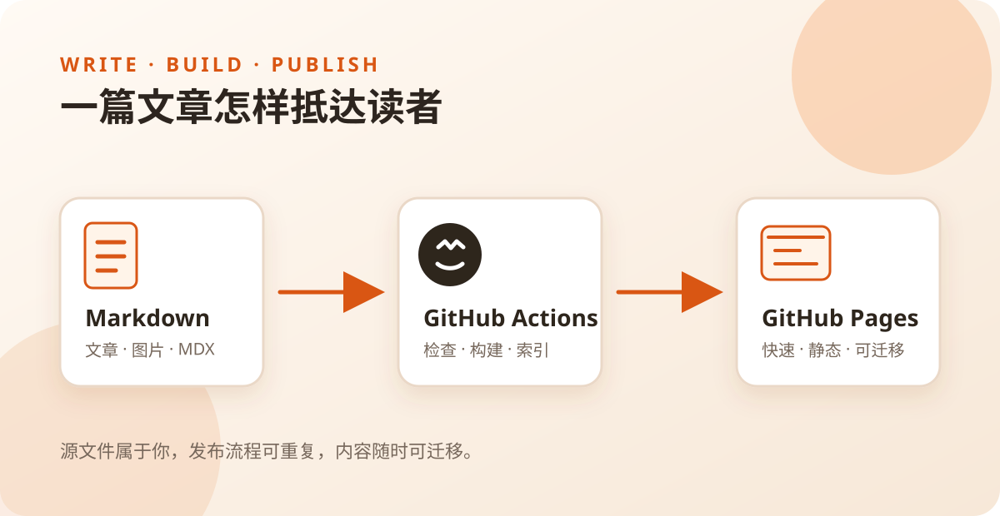

这个博客终于有了自己的第一篇文章。

我想把它当作项目 README 之外的另一块空间：项目适合回答“它是什么、怎么使用”，文章则可以展开记录“为什么这样设计、过程中发生了什么”。

## 这里会写什么

- 开源项目的设计与实现，例如编辑器、浏览器扩展和学习工具
- 开发过程中值得保留的判断、实验与失败
- 对 AI 工具、软件产品和个人工作流的观察
- 偶尔出现的生活记录与尚未成形的想法

## 图文与视频

文章正文使用 Markdown 或 MDX。图片可以与文章放在同一个目录中，提交时一起进入 Git 历史；构建阶段会自动生成适合不同屏幕尺寸的资源。

视频本身不会塞进 Git 仓库。文章可以嵌入 YouTube、哔哩哔哩，也可以播放放在对象存储中的 MP4。外部播放器默认延迟加载，只有读者点击播放后才会连接视频平台；即使嵌入失败，也始终保留原平台链接。

> [!NOTE] 阅读提示
> 文字应该能够独立表达主要内容。视频是补充，而不是理解文章的唯一入口。

## 它怎样发布

所有文章和站点代码都保存在 [`quboliu.github.io`](https://github.com/quboliu/quboliu.github.io) 仓库。每次推送到 `main` 分支，GitHub Actions 会完成类型检查、静态构建、全文索引并发布到 GitHub Pages。

这意味着没有单独的文章数据库，也不需要维护服务器。内容是普通文件，历史由 Git 保存，站点随时可以迁移。

新的记录，从这里开始。
